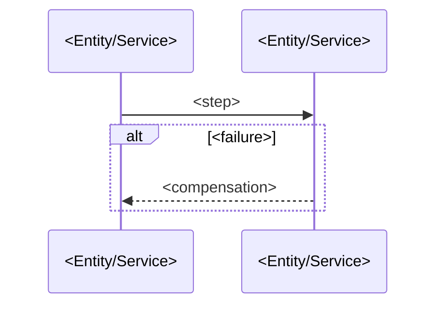

# Flow: <Flow name>

<!-- One flow per FOLDER: docs/blueprint/flows/<project>/<NNN>-<flow>/ —
     THIS file (index.md) is the PLATFORM-AGNOSTIC CONTRACT: what the journey
     is, who triggers it, what it does, and how it is verified. It holds NO
     screens. Each platform that implements the journey adds its own
     <platform>.md beside this file (mobile.md | tablet.md | desktop.md |
     site.md | webapp.md | auto.md | watch.md | tv.md | spatial.md — from the
     flow-platform template) carrying only that platform's Screens +
     Components. Only the nine SCREEN platforms get a file; every other
     platform a project declares (service, worker, packages, cli, and every
     data/system token) is screenless, so a flow of theirs is index.md alone.
     There is no `device:` frontmatter key (format 15): the platform lives in
     the FILENAME, and `auto` covers CarPlay and Android Auto alike — as
     `watch` covers watchOS and Wear OS, `tv` tvOS and Android TV, and
     `spatial` visionOS, Android XR and Quest.

     NNN is DESIGNATED for standard flows and banded for the rest — see the
     standard-flows asset: 010 splash, 020 signin, 030 recover-account,
     040 onboarding, 100 home (the anchor, every product), 110–890 product
     flows (gap-numbered by 10), 910 profile, 920 settings, 930 notifications,
     940 delete-account, 950 audit-history. One number line per project — a
     flow folder covers every platform, so numbers never repeat within a
     project.

     Flows are the PRIMARY blueprint unit: the goal-traceability spine runs
     product goal → flow → entity/API/screen. See the blueprint-authoring
     skill (flow-contract).

     Stack-agnostic and code-independent: name entities, services (by registry
     project name), and operationIds — never queues, libraries, classes, or
     transports, and never a product or vendor name (use the prose noun from
     assets/capability-vocabulary.md — "the datastore", not the database's
     brand). Section→project mapping resolves via docs/blueprint/registry.yaml
     (by project `type`). Omit Background Jobs if the registry has no worker.

     DENSITY: budget ~120 lines. Every line must change what plan or execute
     builds — see the blueprint-authoring density reference. -->

## Purpose

One paragraph. The observable outcome this flow delivers and why it exists.

Serves: [<goal name>](../../../product.md#goal-<slug>)

<!-- Every flow serves at least one product.md goal — the OKF edge the
     blueprint-reviewer verifies. A flow no goal justifies is scope drift. -->

## Platforms

| Platform | File | Notes |
| -------- | ---- | ----- |

<!-- One row per platform that implements this journey, each linking its file
     (e.g. [mobile](./mobile.md)). Which platforms implement a flow is a
     PRODUCT DECISION, elicited — a project declaring `auto` need not carry an
     auto file for every flow (signing in while driving makes no sense), and
     the same holds for `watch`, `tv` and `spatial` (a long form belongs on
     the phone, not the wrist or the couch). The
     rows must be a subset of the registry project's declared SCREEN platforms.
     Notes carry the one-line "how this platform's take differs" (e.g.
     "glanceable subset; no text entry"). Omit this section for a NON-UI flow. -->

## Trigger & Actors

| Actor | May trigger | Authorization | Audit-recorded |
| ----- | ----------- | ------------- | -------------- |

<!-- Who/what can start this flow and under which role. This absorbs the
     authorization contract formerly on entity Actors & Actions; per-operation
     auth also lives in the OpenAPI contract's security. Mark operator and
     destructive triggers audit-recorded (product-foundations baseline). -->

## Steps

1. <actor/system> <action> — touches
   [<Entity>](../../../entities/<entity>/index.md) via `<operationId>`
2. ...

<!-- Ordered, each step naming its actor, the action, and the entity/service
     touched as a resolving markdown link. API-backed steps name the operation
     as `operationId` (defined in docs/blueprint/apis/<project>.openapi.yaml —
     link the contract once under References). Mark audit-recorded steps
     `(audit-recorded)`. A step that changes an entity's state must match a
     transition in that entity's Lifecycle table. Steps are the SAME across
     platforms — a platform that cannot perform a step omits the screens for it
     and says so in its Platforms row; it never forks the journey.

     ONE LINE PER STEP. A step needing a paragraph is either several steps, or
     is carrying a guarantee (→ Guarantees), a screen rule (→ the platform file)
     or a rationale (→ nothing; rationale is not contract). Never restate what a
     linked doc says — the link is the reference. -->

## Guarantees

| Step / group | Consistency | On failure | Idempotency |
| ------------ | ----------- | ---------- | ----------- |

<!-- One row per step or step group whose guarantees differ — not one per step.
     Consistency: atomic | eventual. On failure: the compensation or rollback,
     or `none — <why safe>`. Idempotency: the key a retry is safe under, or
     `n/a`. A flow whose whole journey shares one set of guarantees is ONE row
     covering `all`. Prose belongs here only when a cell genuinely cannot hold
     the decision. (Format 16 merged the former Consistency boundary / Failure
     handling / Idempotency sections — they were three one-bullet sections that
     grew into essays and cross-referenced each other.) -->

## Diagram

<!-- Every flow carries a mermaid sequenceDiagram of its steps — participants
     are the entities/services named above; the failure/compensation path is an
     alt/else branch. A view of the steps, never the contract: it must not add
     or contradict them. Code-independent participant names.

     Labels are TERMS, not sentences ("cancel order", not "the customer cancels
     the order before fulfilment, which"). A label carrying a condition the
     Steps or Guarantees do not is a sign THOSE are incomplete — fix them, not
     the label. -->

## Background Jobs → <worker project(s), from registry>

| Job | Trigger | Timer / Retry | Activities | On failure |
| --- | ------- | ------------- | ---------- | ---------- |

<!-- The jobs this flow requires. Sync/async classification and
     worker-vs-service placement (product-foundations) are decided here. -->

## Acceptance

<!-- Observable Given/When/Then outcomes — what a user or system can verify
     from the outside once the flow ran. At least one success and one
     failure/compensation criterion. Platform-agnostic: the journey's outcome
     is the same everywhere; a criterion that only holds on one platform names
     that platform explicitly. Code-independent: name observable state, never
     test files, fixtures, or tooling. Verified end-to-end by execute's
     acceptance stage and re-run by /vwf:verify against deployed environments. -->

- Given <initial state>, when <trigger>, then <observable outcome>
- Given <failure mid-flow>, when <...>, then <compensation observable>

## References

<!-- Markdown links (OKF edges), not bare text — each must resolve. -->

- [<project> API contract](../../../apis/<project>.openapi.yaml) — for the
  operationIds the steps name
- [auth](../../../conventions.md#auth), [errors](../../../conventions.md#errors)
  (only the cross-cutting sections this flow relies on)
- [design-system](../../../design-system.md) — for any flow with platform files

## Open Questions

<!-- ONLY what blocks THIS flow's contract. Anything else — a future feature, a
     neighbouring flow's behaviour, a scope change — goes to mempalace room
     `gaps` per the parked-scope rule in assets/elicitation.md, never here.
     Omit the section entirely when empty. -->

- [ ] item + date
