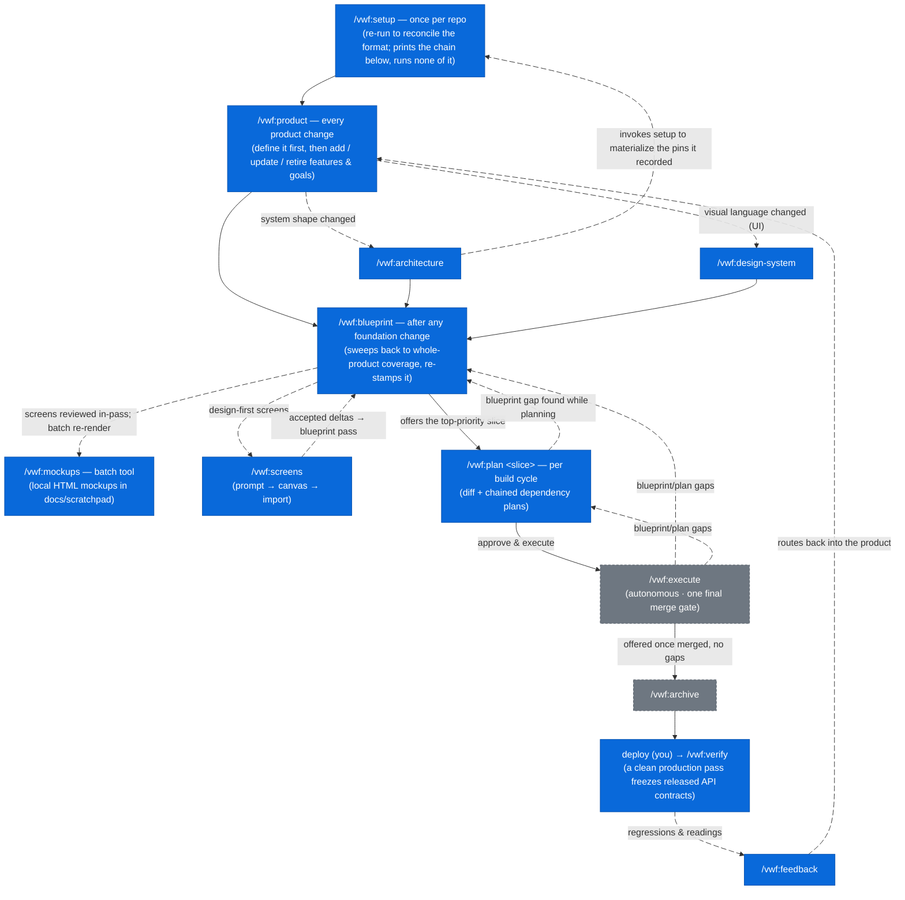
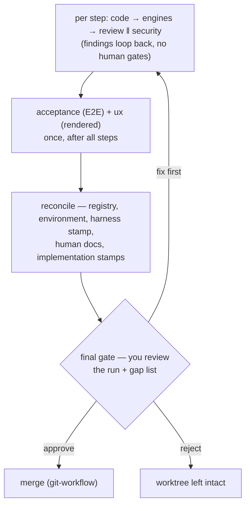

The flagship plugin of the `virajp-plugins` marketplace — an opinionated
workflow that turns a vague idea into a shipped, reviewed product through four
disciplined phases: **Product → Blueprint → Plan → Execute**, with post-deploy
verification and a production-feedback intake closing the loop.

This is the full manual. For the short pitch and the rest of the marketplace,
see [readme.md](https://github.com/virajp/claude-plugins/blob/main/readme.md).

This page is the reference, command by command. If you would rather follow one
product's whole walk through the workflow, the journey-shaped guides are in
[docs/how-to](../how-to/index.md), organized by the situation you are in.

## Install

```sh
# Once
claude plugin marketplace add virajp/claude-plugins

# Installs vwf and its one dependency, stackgen
claude plugin install vwf@virajp-plugins
```

Add `--scope project` to either command to keep it to one repo. Restart the
agent afterwards, then run **`/vwf:doctor`** — nothing is verified at install
time, and doctor is what reports a missing required binary.

Any `pnpx @virajp.dev/claude-plugins` install also wires up **graphify**, which
vwf enforces at its own entry gate. Installing outside a git repo works too:
`graphify install` still runs, and its repo-scoped post-commit hook is skipped
automatically (with a note).

A repo shaped by [`/vwf:init`](#vwfinit) does not need that one-shot at all: its
task library carries `setup:ai`, which registers the marketplace, installs the
plugins the repo declares at **project** scope, wires graphify the same way, and
runs on every checkout. The full description is
[stackgen's task library](./stackgen.md#the-task-library).

Separately, `brew install virajp/tap/claude-status` installs the statusline —
and with it the caps hook that delivers `/vwf:execute`'s resource-cap pause.
`setup:ai` prints that line as a hint when the package is absent, and never
installs it. See [/vwf:execute](#vwfexecute).

Restart Claude Code afterward so the commands, hooks, and dependencies load.

## Prerequisites

`vwf` shells out to a few external tools. Install them first — nothing checks
them at install time, and the table below gives the command for each.

| Tool            | Required?    | Why                                             | Install                               |
| --------------- | ------------ | ----------------------------------------------- | ------------------------------------- |
| mise            | **required** | task runner + resolves the toolchain            | `brew install mise`                   |
| graphify        | **required** | knowledge graph the commands rely on            | `mise use -g pipx:graphifyy@latest`   |
| node + pnpm     | **required** | runs vwf's Context7 MCP server (default runner) | `mise use -g node@latest pnpm@latest` |
| Claude Code CLI | **required** | hosts the commands                              | `mise use -g claude-code@latest`      |
| uv              | **required** | graphify's Python runtime                       | `mise use -g uv@latest`               |
| rtk             | recommended  | the token-saving `rtk hook claude` Bash hook    | `brew install --formulae rtk`         |

**Nothing checks these at install time.** `claude plugin install vwf` succeeds
regardless, so the first thing to run afterwards is **`/vwf:doctor`** — it
reports a missing required one as a **blocking** finding, and both `/vwf:setup`
and `/vwf:execute` halt on one — with one condition on `mise` since
`config_format` 16: with no stack axis pinned anywhere and no harness capability
claimed there is nothing for it to resolve, so its absence degrades rather than
blocks until one is. An earlier installer refused the install outright and
printed the command to fix each; that gate did not come back when the
installer's plugin flags did, so the failure now arrives at first use rather
than at install. `rtk` is the exception — the hook entry is guarded, so a `vwf`
without `rtk` still runs correctly and merely costs more, and `/vwf:doctor`
reports it as a **degradation** every run rather than blocking.

**The memory server runs as your own daemon.** `vwf` declares mempalace over
**HTTP** (`http://127.0.0.1:8765/mcp`), not as a stdio subprocess — start it
with
`mempalace-mcp --transport http --host 127.0.0.1 --port 8765 --palace "$HOME/.local/share/mempalace"`
(loopback needs no token), under a process supervisor. Not `mempalace serve`:
`serve` forks the real server as a child and holds PID 1 itself, so under a
supervisor the server never sees `SIGTERM`. One daemon serves every agent
instance at once, survives session restarts, and reconnects instead of dying
with the session. If you separately install the upstream `mempalace` plugin,
toggle **its** stdio server off in `/mcp` — two servers writing one palace lose
each other's local graph state. See [mempalace](./mempalace.md).

Nothing else about memory needs installing. The two mempalace skills are
**vendored into `vwf`** (`/vwf:mempalace`, `/vwf:mempalace-recall`) and its
auto-save hooks are reimplemented here, so memory arrives with the plugin rather
than depending on anything being reachable at install time.

`vwf` also depends on one plugin — `stackgen` — resolved from the same
`virajp-plugins` marketplace. Claude Code **auto-installs and auto-enables** it
when you enable `vwf` (requires Claude Code ≥ 2.1.143). `devtools` was a second
dependency until it dissolved into `stackgen`; if your machine still has it,
`claude plugin uninstall devtools` — an upgrade stops listing it but leaves it
enabled, shadowing the stackgen packs its skills moved into.

`stackgen` is a dependency because vwf's stack menu is the union of what the
installed stack plugins declare, and the seven axes carry no *other (describe)*
option — so with no stack plugin present, `/vwf:architecture` asks a question
you cannot answer. Having it installed costs nothing if you are not ready to
choose a stack: stackgen acts only when an axis is pinned.

The Markdown/documentation skills and the Context7 docs server used to be two
more dependencies. They are **part of `vwf` now**: `documentation-standards` and
`/vwf:readme` are vwf skills, and Context7 is one of vwf's two MCP servers. The
Karpathy coding guidelines were a third, and are now a **vendored** skill —
`karpathy-guidelines` — for the same reason mempalace's are: as a url-sourced
dependency it was silently absent for most installs, and vendoring puts the
provenance beside the code it governs.

**No CI plugin is among them.** vwf states the delivery-pipeline *contract* —
what a deploy must guarantee, never how it is spelled — and the CI system pinned
on a project's `cicd` axis implements it. Since the `cicd` plugin dissolved,
that system arrives as a [`stackgen`](./stackgen.md) `ci-system` bundle, which
installs with vwf as its dependency.

**A design tool is not among them.** vwf is decoupled from any particular one,
and since Wave D it names none at all. It delegates screen, design-system and
review-conversation imports to three of its own fixed skills, which in turn
delegate to three more fixed names in **the repo's own `.claude/`** —
`design-import-screens`, `design-import-design-system` and
`design-import-conversations`. Those are what the project's `design:` pin
materializes from a stack `design-tool` pack, resolved **per project**, so a
product can design its website with one tool and its app with another. vwf's own
three — `import-design-system`, `import-screens`, `import-conversations` — are
**skill-invoked**: hidden from the `/` menu, reached only from
`/vwf:design-system`, `/vwf:screens import` and `/vwf:feedback canvas`. They
answer in a payload shape no user reads, so there is nothing to type.

Adding a tool is a pack and a menu entry in the stack plugin, never a vwf
change. Export needs no adapter at all, since `/vwf:screens prompt` just writes
design briefs as files.

## Caveats

`vwf` is deliberately heavyweight. Know what you're signing up for before
adopting it.

**Model & cost**

- **Built for a large context window.** The orchestrator holds a lot at once:
  the blueprint, the plan, the registry, and each subagent's output. Run Claude
  Code with the **1-million-token** context; the standard window will degrade or
  overflow on a real cycle.
- **Model and effort are tiered per surface, not uniform.** `opus` runs where
  judgment decides the outcome (`product`, `blueprint`, `plan`, the
  `blueprint-reviewer` and `blueprint-coherence-reviewer` gates) or where nobody
  is watching — `execute` and `change-execute` are the unattended commands, and
  `execute`'s `execute-coder`, code-review, security-review, and ux subagents
  are all `opus` too. `sonnet` runs the remaining commands and the
  writer/surveyor subagents; `haiku` runs the two purely mechanical ones
  (`archive`, `recall`). Effort follows the same logic rather than sitting at
  maximum everywhere: a stronger model reaches the same answer in fewer
  reasoning tokens, so capability and effort are traded against each other per
  surface instead of both being maxed. No gate is weakened — every review stage
  still runs, and config can never disable one.
- **Read-heavy work is delegated to keep the orchestrator fast.** Coverage
  scans, the desired-vs-actual codebase survey, and the bulk doc writing run in
  subagents (`blueprint-surveyor`, `plan-surveyor`, `flow-writer`,
  `entity-writer`) that return conclusions rather than file contents. Anything
  the orchestrator loads is re-processed on every later turn of the pass, so
  keeping scans out of its context compounds across a sweep.
- **High token cost.** An `execute` cycle runs several subagents per step — the
  coder, code review and security review all on `opus`, plus E2E acceptance and
  UX conformance when the slice warrants them — with fix loop-backs. The coder
  is the dominant consumer: it runs per step and per fix round, so `opus` there
  is the single largest cost in the workflow. The wager is that better code
  means fewer `code → review` rounds, and round count drives a cycle's length
  more than per-token latency does. Independent stages also run concurrently —
  review ‖ security per step, all per-doc blueprint reviewers in one round —
  which cuts wall-clock but not spend. Expect a meaningful cost per slice; this
  is not a cheap workflow.

**Dependencies**

- **External prerequisites, checked at run time rather than install time.**
  `mise`, `graphify`, `uv`, `pnpm` and `rtk` must be on your `PATH`. Nothing
  refuses the install any more; `/vwf:setup` and `/vwf:execute` halt on a
  missing `graphify` — and on `mise` once a stack is pinned — `/vwf:doctor`
  reports a missing `rtk` as a **degradation**, and `uv` and `pnpm` fail later
  in their own ways. Dependency auto-install/enable needs Claude Code ≥ 2.1.143.
  See [Prerequisites](#prerequisites).
- **Memory is written twice, so mempalace is optional.** Every memory write goes
  to both `mempalace` (an **HTTP daemon you run** —
  `mempalace-mcp --transport http`) and a markdown tree under `docs/memory/`.
  Without the daemon nothing is lost, but recall degrades from semantic search
  to grep, and says so. `decisions`, `planning`, `gaps` and `problems` are
  committed; `handoff`, `doctor` and `runs` are gitignored, being one
  developer's state rather than the team's.
- **Leans on review engines.** `execute` runs the `/code-review` and
  `/security-review` engines itself, once the coder returns, and hands their
  findings to the code- and security-review stages; a reviewer falls back to its
  own manual review dimensions when its engine is unavailable.

**Fit**

- **High-touch where it matters, autonomous where it doesn't.** The authoring
  phases (product, architecture, design-system, blueprint, plan) ask one
  question at a time and gate on your approval — plan for interactive sessions.
  `/vwf:execute` then runs the approved plan **unattended**: code, code review,
  and security review per step (plus one acceptance + ux pass after all steps),
  deciding from a fixed rule set and stopping only on a hard halt, a resource
  cap, an all-blocking gap, an irreversible decision — or the **final gate**,
  where you review the whole run and approve the merge.
- **Released APIs are frozen.** Once `/vwf:verify` records a production release,
  breaking a released API contract is blocked like a security finding —
  reviewers loop it until fixed, and the only way out is a conscious
  major-version bump. If you want to move fast and break contracts, this will
  fight you.
- **Requires a testable project.** `execute` enforces non-negotiable TDD and a
  coverage gate. A project without a test runner won't fit the execute stage;
  missing coverage tooling is tolerated (the coder reports `coverage: n/a` and
  the gate decides). The verification harness (dev server, E2E suites, staging
  mode) is self-healing: `setup` detects and stamps what exists, and `plan`
  injects bootstrap steps for whatever a slice's gates need — so harness gaps
  surface at plan time with their fix attached, not as surprises at a gate.
- **Assumes a registry-described workspace.** `plan` and `execute` map each
  slice to a project in the architecture registry and read its code (submodules
  included). You model the codebase with `/vwf:architecture` first; it won't
  operate on an ad-hoc folder. Work that has no slice behind it goes to
  `/vwf:change-plan` → `/vwf:change-execute` instead, which read no registry and
  no blueprint.
- **Structure and stacks are both menus.** `vwf` ships three topology templates
  (`repo` / `monorepo` / `multi-repo`) and `/vwf:architecture` presents stack
  templates per axis — you pick, and the choice plus its reason is recorded so
  it is never re-litigated. A multi-repo product picks a **linkage** too:
  `submodule` (recommended) or `siblings`, so a product whose repos are ordinary
  clones needs no restructuring to be onboarded.
- **Solo / small-team focus.** It is highly opinionated — one workflow, one set
  of conventions. Great for a solo dev or small team; not a configurable
  framework for a large org.

## The mental model

Each phase answers one question:

- **Product** answers *is this worth building, and what does "good" mean?* — the
  problem, the users, measurable goals, and the order to build in. Every flow in
  the blueprint must trace to a goal here.
- **Blueprint** answers *what should the whole product be?* — permanent,
  product-wide, organized by **flow** (the user/system journeys, grouped by the
  registry project that owns each journey and numbered in execution order —
  mobile-app flows live apart from website and console flows), with entities as
  the supporting data contracts. It is a **code-independent technical
  contract**: it pins every decision that has more than one reasonable answer
  *and* is true regardless of how the code is written — flows (each with
  acceptance criteria and a sequence diagram, carrying the screens and jobs they
  need), data models as JSON-Schema `schema.yaml` files, API surfaces as
  per-service OpenAPI contracts, relationships, concurrency, and UI/UX — so
  `plan` and `execute` never have to ask or assume. A whole-product coherence
  review walks every flow across the entities and contracts before coverage
  counts as complete. Reuse-vs-build, file placement, ordering, and library
  choices are `plan`'s job, not the blueprint's.
- **Plan** answers *what changes for this one slice, and in what order?* — a
  diff, not a re-blueprint, scoped to a single flow or entity. Unbuilt
  dependencies are not swallowed into the plan: each becomes **its own plan**,
  chained (`covers:`/`requires:`) and executed in order.
- **Execute** answers *is it built, correct, safe, and does it do what the
  blueprint promises?* — TDD, then code/security review, then E2E acceptance and
  rendered-UI conformance. When the run lands, it stamps each covered blueprint
  doc's `implementation:` state — the blueprint stays the source of truth, and
  it now knows what's built.
- **Verify & feedback** answer *does it hold in production, and what next?* —
  post-deploy checks against the same acceptance criteria, and a routed intake
  for what production teaches you. A clean production run offers to record a
  **release**, freezing each service's API contract — from then on, breaking a
  released API is blocked like a security finding unless you consciously cut a
  new major version.

Each command has its own cadence — `setup` once, `product` on every product
change, `plan` per build cycle — and the transitions chain from gate offers.
**Blue** nodes are commands you prompt; **gray dashed** nodes run without you
typing them (you only approve at their gates):



(`setup` **prints** the chain `product` → `architecture` → `design-system` →
`blueprint` and offers to start the first one; it runs none of them, because
each resolves its own mode and reports what it did. The one arrow back into
`setup` is `architecture`'s own: having recorded the stack pins and materialized
nothing, it invokes setup in-session so
[the materialize pass](#the-materialize-pass) lands them. Blue marks who prompts
them. Fully internal machinery never appears in the flow: `/vwf:git-workflow` is
invoked by the other commands for every git action, `/vwf:docs-sync` closes
every run that changes reality (and is yours to run after ad-hoc work), the five
execute subagents and the reviewer subagents run inside their commands, and
`handoff`/`recall` are session utilities you reach for only when a session runs
long.)

`/vwf:setup` runs once per repo (re-run to reconcile the format), and hands you
the chain rather than walking it. From there on, **`/vwf:product` is the front
door for every product change** — adding, updating, or retiring features and
goals — with `architecture` following when the system's shape changes and
`design-system` when the visual language does. Any foundation change ends in a
`/vwf:blueprint` sweep, which loops flow by flow (deriving the entities,
schemas, and API operations each flow stands on) until the **whole product** is
covered again — including a whole-product coherence review — and re-stamps that
coverage (`plan` refuses to run without it), then offers to plan the top slice.
Building is **one command per cycle**: `/vwf:plan <slice>` resolves the slice's
unbuilt dependencies into a **chain of small plans** (each behind its own gate,
executed in order — never one plan swallowing its dependencies), the last gate
offers *Approve & execute*, `execute` runs each plan unattended in a dedicated
worktree up to one final gate where you review the run and approve the merge —
stamping the covered blueprint docs' `implementation:` state as it lands — and
`archive` is offered once no gaps remain. After you deploy, `verify` checks the
environment (and, on a clean production pass, offers to freeze the released API
contracts) and `feedback` routes what production says back into the product.
When execution exposes a hole in the blueprint or plan, `vwf` captures it and
loops back to fix the source — never silently working around it.

Work with **no blueprint slice behind it** — tooling, CI, a docs tree, a
refactor, a repo the blueprint does not describe — never enters this chain at
all: it goes to [`/vwf:change-plan`](#vwfchange-plan) and then, in a fresh
session, [`/vwf:change-execute`](#vwfchange-execute), which sit beside the chain
and read no blueprint.

## The documents it maintains

`vwf` keeps everything in version-controlled Markdown under `docs/`. The
blueprint is the desired state; the plans are the changes you apply to reach it.

```text
.config/
└── vwf.yaml                     # the vwf config — how vwf operates here (stamp,
                                 # harness, enforcement opt-outs, knobs, environments)
docs/
├── blueprint/                   # the always-current blueprint (desired state)
│   ├── product.md               # problem, users, measurable goals, slice priority
│   ├── registry.yaml            # machine-readable Project Registry (what every command parses)
│   ├── architecture.md          # system shape, in prose + a diagram (its human view)
│   ├── design-system.md         # product-wide UX/visual contract (if UI)
│   ├── conventions.md           # cross-cutting decisions (auth, errors, …)
│   ├── environment.md           # per-project env-var/secret catalog (names, never values)
│   ├── flows/                   # the PRIMARY unit — grouped by project, numbered
│   │   ├── index.md             # flow catalog (per-project sections) + inter-service contracts
│   │   └── <project>/           # one group per registry project owning the journeys
│   │       └── <NNN>-<flow>/    # NNN designated: 100 = home, 010/020/030/040 entry,
│   │           │                #   110–890 product, 910–950 account and audit screens
│   │           ├── index.md     # the PLATFORM-AGNOSTIC contract: trigger, actors,
│   │           │                #   steps, jobs, sequence diagram, acceptance
│   │           └── <platform>.md # one per implemented platform (mobile, tablet,
│   │                            #   desktop, web, auto) — screens (coded rows +
│   │                            #   per-screen components blocks), plus a
│   │                            #   per-screen Metadata block on site/webapp
│   ├── entities/                # the supporting data contracts
│   │   ├── index.md             # entity catalog + product-wide ER diagram
│   │   └── <entity>/            # index.md (lifecycle, relationships, invariants)
│   │       ├── index.md         #   + schema.yaml (the data model, JSON Schema)
│   │       └── schema.yaml
│   └── apis/                    # authoritative API contracts (OpenAPI 3.1)
│       ├── <project>.openapi.yaml  # one per API-publishing project
│       │                           # (a project declaring `service`)
│       └── released/            # frozen production snapshots — the release
│           │                    # record backward compatibility is enforced against
│           └── entities/        # every entity's schema.yaml, frozen at the same
│                                # release moment — <entity>@<date>.schema.yaml
├── plans/                       # per-cycle plans (the diff to apply)
│   ├── <date>-<time>-<slice>.md # covers:/requires:/backlog: links + a "Gaps
│   └── archived/                # surfaced during execution" section
├── backlog.md                   # the prioritised list of work that waits —
│                                #   base repo only, one per product,
│                                #   /vwf:backlog is its only writer
├── prompts/                     # canvas design briefs (committed intent)
│   └── <type>/                  # prompt type (e.g. screens)
│       └── <project>/           # registry project
│           ├── CLAUDE--<platform>.md # the platform canvas project's conventions
│           │                         # CLAUDE.md source (one per pinned design
│           │                         # project; canvas-owned section preserved
│           │                         # on regeneration)
│           └── <NNN>-<flow>/    # the flow the briefs commission
│               └── <platform>.md # ONE brief per platform (mobile.md, tablet.md,
│                                 # desktop.md, web.md, auto.md) — mirrors the
│                                 # flow folder's platform files; always the
│                                 # flow's full blueprint, regenerated in place
└── runbooks/                    # operational runbooks (incident-response foundation)
    └── postmortems.md           # postmortem stubs /vwf:feedback incident appends
```

Each flow doc holds one journey end to end — who triggers it, the steps across
entities and services, the screens and jobs it needs, and the acceptance
criteria that prove it. Each entity doc is the data contract under those flows
(`Used by:` links them), with its authoritative shape in `schema.yaml`. Flow and
entity docs carry an `implementation:` frontmatter stamp the pipeline maintains
— the blueprint always knows what's built. The **Project Registry** is its own
file, `registry.yaml`, which `blueprint` and `plan` parse to map a flow's
sections to the right project by `type`; `architecture.md` is the prose view of
the same facts and no command reads it.

The registry carries **no stack**. Which technology each project is built with
lives in `.config/vwf.yaml`, as a structured block naming the template you
picked plus its languages, frameworks and key dependencies. That split is not
bookkeeping: it means no blueprint-authoring or reviewing surface can see a
technology name, so a blueprint that mentions your database, cloud, or payment
vendor fails review by construction. Docs say "the datastore" and "the payment
provider", and stay true when you swap either.

## Structure

Structure is a **menu**, like stacks. `vwf` ships three topology templates and
`/vwf:setup` presents the one it detects for confirmation; the choice and its
reason land in `.config/vwf.yaml` and are never re-litigated.

| Topology     | What it is                                             | `docs/blueprint/` lives |
| ------------ | ------------------------------------------------------ | ----------------------- |
| `repo`       | One codebase, deployed as a whole                      | the repo root           |
| `monorepo`   | One VCS repo, several independently-buildable projects | the repo root           |
| `multi-repo` | A group of repos coordinated by a **base** repo        | the base repo           |

The deciding question isn't project count — it's whether the product's code can
share **one dependency graph and one release cadence**. Yes → `monorepo`. No →
`multi-repo`. A Flutter app beside a TypeScript backend is the classic no: store
review can't sync with continuous deploy, and Dart can't share a dependency
graph with TypeScript.

A multi-repo product has a **base repo** holding the blueprint, the config and
the plan index — and no product code — plus one or more **members** holding the
code. How the members are wired is the `linkage:` choice:

**`linkage: submodule`** (recommended) — the members are git submodules, so one
`clone --recurse-submodules` reproduces the product at a known-good set of
commits, and the pointer commits record which member versions were ever
consistent together:

```text
my-product/           # base repo — vwf lives here
├── .gitmodules
├── docs/blueprint/   # the vwf bundle (one per product)
├── docs/plans/index.md
├── backend/          # submodule — a monorepo
│   ├── projects/     # api · worker · web · ops
│   └── packages/
│       └── common/   # the shared kernel
└── app/              # submodule — a single repo (Flutter)
```

**`linkage: siblings`** — the members are ordinary repos cloned next to the
base. Nothing wires them in git, so vwf does it: the base's `members:` list
names each one (with the git URL to clone it from), and each member carries
`.config/vwf-membership.yaml` pointing back. That back-link is load-bearing —
without it, running `/vwf:plan` from inside a member would find no config and
report a perfectly onboarded repo as un-onboarded.

```text
~/Projects/acme/
├── acme-product/     # base repo — docs only
│   ├── docs/blueprint/
│   └── .config/vwf.yaml     # members: [...]
├── acme-api/         # plain repo
│   └── .config/vwf-membership.yaml
└── acme-app/
    └── .config/vwf-membership.yaml
```

**Not every member has to be on your machine.** A twenty-repo product doesn't
fit on one laptop, and vwf detects what's present on every run rather than
recording it — presence is per-developer state, not a property of the product.
When a command needs a repo you don't have, it offers to clone it; decline and
it proceeds with that project excluded and **says which projects it couldn't
inspect**. `/vwf:execute` is the exception and stops, since it can't write code
into a repo you don't have.

**Where plans live:** a plan lives in the repo whose code it changes, and the
base repo keeps a thin `docs/plans/index.md`. In a `repo` or `monorepo` product
that's the one checkout, so the rule costs nothing.

Existing repos whose layout differs from their topology's suggested grouping get
a **written recommendation** from `/vwf:setup` — never a move. setup writes and
moves documentation only; every source-layout change, in-repo or across a repo
boundary, is named in the report with its target layout and left to you.
Recording a decline under `enforcement:` stops the proposal recurring, not the
finding: `/vwf:doctor` keeps reporting it. Adding or removing a repo later is
incremental, and removing one **archives** its blueprint docs rather than
deleting them.

### Stack templates

The stack is **not** enforced — and **vwf itself ships no stack templates at
all**. It defines the axes, the `role` vocabulary and the template shape; every
actual option lives in a **stack plugin**, under whatever layout that plugin
keeps — vwf never reads one by path, only through two fixed adapter skill names.
`/vwf:architecture` presents the union across your installed plugins as a menu —
one round per project. The menu is the **whole** answer: there is no *other
(describe)* option, so an axis nothing on it fits is never recorded as a
free-text pin (see below). Each project carries exactly one role, so it picks
exactly one project template and there is nothing to merge. Install no stack
plugin and the menu is empty — since `config_format` **16** that is a
postponement rather than a dead end: vwf names the three ways forward (install
the plugin that has one, write it, or **defer the axis** as `unresolved`) rather
than coming back quietly short.

A stack is composed from **seven independent axes** — you answer each one, and
they never merge because they never overlap. `project` and `repo` take a single
template; `backing` and `deploy` take a **list**, one entry per capability and
one per delivery mechanism (`deploy_template` became a list in `config_format`
**16**, because a project routinely publishes to a package registry *and* ships
a container image):

| Axis           | Scope       | Takes                                                                                                          |
| -------------- | ----------- | -------------------------------------------------------------------------------------------------------------- |
| **project**    | per project | one template, filtered by the platforms the project declares — see below                                       |
| **backing**    | per project | a list — one entry per capability the project talks to (datastore, identity, telemetry, …)                     |
| **deploy**     | per project | a list — one entry per delivery mechanism the project ships through                                            |
| **repo**       | per repo    | one template describing the checkout — its package manager and workspace layout                                |
| **design**     | per project | one design tool — the slug *is* the config value                                                               |
| **cicd**       | per project | one CI system — the slug *is* the config value                                                                 |
| **stylesheet** | per project | one stylesheet approach — the slug *is* the config value; asked only of a project declaring `site` or `webapp` |

**No slug appears in that table on purpose.** The roster is not vwf's to state:
the menu is the union of what your **installed** stack plugins declare, so it
changes with what you install, and `/vwf:architecture` is what enumerates it for
your repo. Today [stackgen](./stackgen.md) is the only stack plugin, and it
carries all seven axes — the general-purpose set, the managed backing and deploy
services of each cloud it packs, and a generator for whatever no pack covers.

Since `config_format` **13** every axis but `repo` is pinned **per project**, so
a product can host its site on Cloudflare, its API on GCP and its worker
somewhere else again — and design its app in one tool while its website is
designed in another. On the `design`, `cicd` and `stylesheet` axes — the three
**tool axes** — the slug **is** the config value, so the menu pick and the
config key are one value rather than two that can disagree. Only `repo` stays
per repo; it describes the checkout, not a project.

**vwf ships no default, but it honours one the plugin declares.** A menu entry
may arrive flagged `default: true` — set in the stack plugin's own bundle, never
inferred by vwf — and that entry is what the round **preselects**: highlighted,
never assumed, with every other entry still offered and the user still picking.
At most one entry per axis carries it; where none does, the round preselects the
previous project's answer on that axis, and nothing before that. The flag is
menu state only — it reaches no config key, and a pin made by accepting it is
indistinguishable from one made by picking the same entry. Today the one flagged
entry is stackgen's terminal design tool on the `design` axis.

**The `stylesheet` axis is conditional.** Added in `config_format` **19**, it is
asked only of a project whose registry entry declares a `site` or a `webapp`
platform, and it is asked **after** that project's design round: the design
system's semantic tokens are the contract and the stylesheet is how they are
realized, so the order is the dependency rather than a preference. A project
declaring neither platform is never asked and records no key at all.

**An axis can also be left unanswered.** Since `config_format` **16** any of the
seven may read `unresolved` — deferred, not decided — which is the line between
*defining* a product and *building* one. `/vwf:product`, `/vwf:architecture`,
`/vwf:blueprint`, `/vwf:design-system` and every other doc surface run to
completion with no stack chosen at all; `/vwf:doctor` reports the deferral as a
**degradation** every run and its stack-dependent checks report
`not checked — no stack resolved`; and `/vwf:plan` and `/vwf:execute` **halt**,
naming the axis and pointing at `/vwf:architecture`, because both size their
work against the pinned templates' conventions and an unresolved axis has none.
`unresolved` is not `template: custom` returning: `custom` asserted a stack that
did not exist and let the pipeline run on silently, while `unresolved` says out
loud that nobody has chosen — which is exactly why plan and execute refuse. `[]`
on the two list axes is its opposite: a decision that this project ships through
nothing, or talks to no backing service.

**Project-axis templates.** A template declares **which platforms it serves**,
and that list is what the menu filters on. One template routinely covers
several: an app framework can build four surfaces from one codebase, and a
full-stack template serves an API and its own UI — what the retired `fullstack`
role meant. **Your pin must cover every platform your project declares**, which
`/vwf:doctor` checks. Which templates exist, and what each is made of, is the
stack plugin's answer — [stackgen](./stackgen.md) states the set it ships.

**Templates ship in a stack plugin, never in vwf.** vwf has no `stacks/` tree at
all: it owns the seven axes, the platform vocabulary a template declares
against, and the two adapter skill names it reaches a plugin through. So a
product gets whichever menu its installed plugins add up to, and one that
installs nothing sees an empty one.

**Why the split matters.** The same Hono + Effect service runs against Firebase
or Postgres, on Cloud Run or any container host. Before `blueprint_format` 19
all three were welded into one document, so picking `service` because you wanted
Hono silently also bought you Firestore, Firebase Auth, Temporal and Cloud Run —
none of it declared. Now a project template names no vendor and a backing
template names no framework — and a backing template is now one capability
rather than a vendor bundle, so `postgres` + `oidc` + `otel-lgtm` + `temporal` +
`audit-store-postgres`, each a stackgen bundle, is a completely vendor-free path
through vwf. That last one is the shape to notice: an audit store is its own
capability (`audit-store`), pinned beside the datastore rather than folded into
it or into the telemetry sink.

An operator back-office is `backend` / `platforms: [service, webapp]` plus the
`operator-rbac` capability (`webapp` sits under `backend` as well as `frontend`
for exactly this shape), and picks whichever project template serves both of
those platforms at once. A project shipping through a store rather than to a
deploy target (`mobile`, `tablet`, `desktop`, `auto`) records `[]` on the deploy
axis, as does an `iac` project — it *is* the deploy path. A `cli` project pins
one, because a package registry is its target; **which** template that is is the
stack plugin's answer, and vwf names no slug on this axis or any other.

**`iac` is the one platform vwf constrains structurally.** A project declaring
`iac` must live in **its own repo** — independent, or a member of the product's
base repo — under every topology, monorepo included. Blast radius, credentials,
lifecycle and cadence all differ in kind from application code, and one repo
cannot separate them. `/vwf:doctor` raises a violation as a **blocking** finding
and `/vwf:setup` writes the extraction up as a recommendation — it moves
nothing. Recording the decline under `enforcement:` drops the finding to a
warning reported every run, and neither `setup` nor `execute` halts on it after
that. Nothing else about repo shape is enforced.

A template reaches vwf as a **payload**, never as a file: its stack facts
(**languages**, **frameworks**, **dependencies**, plus the optional languages a
template admits — Flutter's Kotlin and Swift) and its **conventions** prose,
carrying the layout, testing and deployment rules. How a stack plugin stores
that template is its own business. Picking one fills those facts into
`.config/vwf.yaml`; you can then customize any of them. **Picking is
`/vwf:architecture`'s and landing is `/vwf:setup`'s** — architecture records the
slug and materializes nothing, then invokes setup, whose materialize pass asks
the plugin for the template once per (repo, slug) and lands it in the repo that
project belongs to.

Only the axes land in the config — the conventions prose stays with the plugin,
and `/vwf:plan` and `/vwf:execute` fetch it when they run: deduped by template
slug, once per run, before any work starts. That is what they size steps and
write code against, so a fetch that fails halts rather than degrading — code
written to conventions nobody read is indistinguishable from code written to
conventions that said nothing. The prose reaches `docs/plans/` and your source,
and never `docs/blueprint/`: it names technology, which is exactly what a
blueprint doc may not.

**vwf names no language, but the menu is closed.** A language token is whatever
a template declares, and the facts the tooling acts on — which LSP server covers
it, which manifest identifies it, which mise tool installs it — come from the
**language plugin** that owns it. vwf holds no table of its own; the union of
what the installed plugins declare **is** the vocabulary. `/vwf:doctor` reads
the block back and checks the repo agrees: an LSP server and toolchain per
declared language, every framework and dependency present in the project's
manifest, the repo's package manager and tooling, harness task names, health
paths. It reports drift in both directions, including a framework doing obvious
structural work that your config never mentions.

A language no installed plugin claims is reported as *unknown*, and since
`config_format` **14** that is a **blocking** finding: `/vwf:setup` and
`/vwf:execute` both halt on it. Since **16** the severity follows the pin: while
the project's `template` reads `unresolved` an unclaimed token is only a
**degradation** — the plugin that would claim it is exactly what has not been
chosen yet — and such a project legally records `languages: []`. The moment the
axis is pinned, unknown is blocking again. There is likewise no *other
(describe)* option and no `template: custom` — an axis nothing on the menu fits
has three ways forward, none of them a free-text pin. vwf is an opinionated
workflow that plans against a template's conventions, builds against its harness
and gates a UI slice on its UX contract; a stack no plugin defines supplies none
of those, so a run against it would lose every guarantee *while reporting itself
healthy*. Many stacks are supported — every one of them defined by a plugin.

The one second door is the **materialized escape**: a materializing adapter (the
[`stackgen`](./stackgen.md) plugin) can land a template directly in the repo's
committed `.claude/` tree through consent-gated, reviewer-gated generation, and
a language whose pin carries that template's emitted `language_facts` (LSP
provision, mise tool, manifest) is *known* — doctor verifies against the facts
instead of a language plugin. A token with neither stays blocking; nothing about
the escape re-opens free text.

That landing happens in **`/vwf:setup`'s materialize pass**, once per (repo,
slug), never at the moment the pin is made — so a freshly recorded pin is
expected to sit unmaterialized until setup runs, which is the handoff working
rather than a gap. A pin whose landing you **declined**, or a repo setup has not
re-run on since, is doctor's own finding: **pinned, not materialized —
`/vwf:setup` materializes it**, blocking while the pin stands, one row per
project rather than one per language, and never confused with `unresolved`. The
axis was answered; what is missing is the artifact.

Adding a stack option means adding a template file **to a plugin**, never to
vwf. One entry per type today is a starting point, not a default.

Two placement rules ride along with the shape — seeded into each repo's
`conventions.md` and enforced by the execute reviewers:

1. **All shared schemas live in `packages/common`** — Effect Schemas, one export
   subpath per entity; no other project defines a shared data schema.
2. **All third-party integrations go via `packages/common`** — Firebase and
   every other external service are wrapped once as Effect layers; no other
   project imports a third-party SDK directly (client-side sign-in is the one
   exception).

They are joined by the **engineering baseline** — 16 centralized technical rules
seeded into `conventions.md#baseline` on the blueprint's first touch and
followed by default everywhere; only exceptions are documented. The set:
optimistic **write versioning** on every mutating write (entity docs stop
re-deciding concurrency — the default is the contract), atomic multi-document
writes, server-authoritative UTC timestamps, soft-delete by default, strict
**boundary validation** (malformed input/output rejected, never coerced — the
one rule that can never be waived product-wide), business/technical code
separation with backing services as attached resources (injected config only),
idempotency keys on every mutating operation, one error envelope, cursor
pagination, retry-only-idempotent with backoff + jitter, tolerant-reader event
consumers, **stateless processes** (every service/worker safe at N replicas),
**graceful shutdown** (acknowledged work never lost to a termination),
structured logs with no PII (logs/traces/metrics through one vendor-neutral
telemetry pipeline), integer minor units for money, and **expand → migrate →
contract** for non-additive stored-schema changes (expand and contract never
share a release, so every release stays compatible with the one before it). A
deviation lives in **two places, always**: stated on the doc it applies to and
waived under `enforcement.rules` (`baseline/<rule>[/<unit>]`) — the blueprint
reviewers flag either half missing, and the execute reviewers enforce the rules
against the code itself.

Beside the baseline sits the **principles catalog** (`assets/principles/` —
thirteen entries: KISS, YAGNI, DRY and its limits, the five SOLID principles,
information hiding, design by contract, idempotency, explicit error semantics,
least privilege). The baseline is enforced contract; the catalog is the
**judgment** applied where the baseline is silent. Every entry has the same
fixed shape — definition, smells, how a reviewer verifies it, application
patterns, and **when not to apply it**, the last section being the
anti-rubber-stamp defense: a principle recited without its limits is a slogan.
Reviewers may cite an entry to make a judgment-call finding contestable rather
than taste, and the catalog is what the `stackgen` plugin instantiates when it
generates stack skills for a technology no curated pack covers.

Alongside it sits the **delivery-pipeline contract**
(`conventions.md#pipeline`): three canonical environments — `development` (the
developer's machine, any branch, never deployed), `staging` (testers only) and
`production` (customers) — with `dev`/`test`/`prod`-style synonyms treated as
drift. Each deployed environment releases from **exactly one branch**; which
branch is the product's to choose and record there, `develop` and `main` being
the default pair. A deploy is **deliberate** — an explicit act naming one
project and one environment, never a side effect of a branch push, and
re-validated by the pipeline rather than trusted from its trigger — the pipeline
**proves the commit is reachable** from that environment's branch, and **no
deploy step runs before the released project's and its dependents' tests pass in
the same run**. A staging deploy is never a release; production releases are
recorded only by `/vwf:verify`. Three further rules bind the release itself: a
flow whose declared peak rate meets the load threshold gets a staging load run
before its first production release, every production deploy states the release
it rolls back to (or records that it is irreversible), and every release-capable
run audits the lockfile — a known-critical advisory fails it, waivable only per
advisory and with a date. The contract names no mechanism on purpose: the tag
grammar `<project>-<env>-v<semver>`, the trigger globs and the reachability
check are the recommended default, owned by the CI system pinned on the
project's `cicd` axis — [`stackgen`](./stackgen.md)'s
`contracts/release-trigger.md` and its `ci-system` pack.

The **operator back-office** deserves a note. Since format 22 it is not its own
role: it is `backend` / `platforms: [service, webapp]` plus the `operator-rbac`
capability — a single app serving both the operator API and an embedded UI, and
the **sole holder of admin capabilities** (the public `service` exposes no admin
routes). The capability, not a type name, is what marks it. It is also where the
**audit store** lands: accepting the audit foundation adds `audit-store` to this
project's capabilities, because the console is the only thing that reads audit
records.

The full stack docs ship inside each **stack plugin** under its own `stacks/`
tree — never in vwf — and drive what `/vwf:setup` and `/vwf:architecture`
record.

## Commands

| Command                        | What it does                                                                                                                                                    |
| ------------------------------ | --------------------------------------------------------------------------------------------------------------------------------------------------------------- |
| `/vwf:init`                    | Internal — shape the base repo **and every member repo** (config layout, task library, gates, hygiene files, a licence); reached only through `/vwf:setup`      |
| `/vwf:setup [reshape]`         | Onboard/migrate a repo into vwf's format; `reshape` runs the repo-shape pass alone, across every member (re-runnable)                                           |
| `/vwf:product [note]`          | The Phase −1 outcome contract — problem, users, goals, slice priority; an optional feedback note seeds the update questions                                     |
| `/vwf:architecture`            | Bootstrap or update the system shape + Project Registry                                                                                                         |
| `/vwf:design-system`           | Import the product's design system from its design tool into the contract (mandatory once UI exists)                                                            |
| `/vwf:blueprint [flow]`        | Sweep the full-product blueprint flow by flow to complete, coherent coverage                                                                                    |
| `/vwf:mockups [flow]`          | Batch re-render of screen mockups into docs/scratchpad (blueprint passes render in-pass)                                                                        |
| `/vwf:screens <mode>`          | Two-way screen sync — `prompt <flow>` briefs the canvas, `import` folds designs back via blueprint                                                              |
| `/vwf:plan [slice]`            | Write reviewable cycle plans — a diff of blueprint vs code, deps chained as plans                                                                               |
| `/vwf:execute [plan]`          | Run an approved plan autonomously — TDD, reviews, E2E + UX, one final gate                                                                                      |
| `/vwf:archive [plan]`          | Retire a plan into `docs/plans/archived/` — a flat cycle plan file, or a whole change-plan folder                                                               |
| `/vwf:doctor [project]`        | Check the repo against `.config/vwf.yaml` — LSPs, toolchains, manifests, harness, dependency audit, mempalace, graphify, the repo shape of every member, stamps |
| `/vwf:verify [env]`            | Post-deploy: health-check + re-run acceptance criteria against the environment                                                                                  |
| `/vwf:feedback [input]`        | Route production feedback to the doc/command that fixes it (`canvas` harvests each project's design review chat)                                                |
| `/vwf:backlog [verb]`          | The prioritised list of work that cannot be picked up now — `docs/backlog.md`, and this is its only writer                                                      |
| `/vwf:change-plan [what]`      | Plan an ad-hoc change — work with no blueprint slice behind it — into a folder `/vwf:change-execute` can run                                                    |
| `/vwf:change-execute <folder>` | Run an approved change plan unattended in a fresh session — waves, review, the plan's own gate, then land                                                       |
| `/vwf:handoff [name]`          | Capture the session so work resumes in a fresh one — no name writes the reserved `next`                                                                         |
| `/vwf:recall [name]`           | Resume from a handoff in a fresh session — no name resumes `next` and runs its continuation                                                                     |
| `/vwf:readme`                  | Scan a repo and write or update its README against eight required sections                                                                                      |
| `/vwf:docs-sync [range]`       | Reconcile the repo's human docs with a change that landed — README, CLAUDE.md, guides, app changelog                                                            |
| `/vwf:git-workflow`            | Internal — worktree isolation, commits, merges                                                                                                                  |

**Six are user-only** — `setup`, `verify`, `mockups`, `archive`, `recall` and
`change-execute` carry `disable-model-invocation: true`, so the model never
fires them on its own; you decide when a migration, a post-deploy check, a
re-render, a plan retirement, a session resume or an unattended change run
happens. `change-execute` is user-only for a reason of its own: it must start in
a session that has done nothing else, and only you can guarantee that. Its
partner `change-plan` stays model-invocable, and that seam is now live: a
`/vwf:feedback` intake that turns out not to be a blueprint gap routes into it
by name. The rest stay model-invocable because the workflow **delegates to them
by name** — `recall` resumes a paused run *through*
`blueprint`/`plan`/`execute`, every skill commits *through* `git-workflow`,
`setup` runs `doctor` inside its own spine, and `feedback` and `plan` route work
into `product`/`architecture`/`design-system`/`blueprint`. Marking one of those
user-only would silently break the chain: the flag blocks programmatic
invocation, not just auto-triggering.

**Four skills go in the other direction** — hidden from you, reachable by a
skill. Each carries `user-invocable: false`, which keeps it out of the `/` menu,
*and* `disable-model-invocation: false`, which keeps its caller's invocation
working; a user-only skill would have made that call a silent no-op. `init` is
reached exactly two ways, both through setup: Step 0's offer, or
`/vwf:setup reshape`. The three import adapters — `import-design-system`,
`import-screens` and `import-conversations` — are reached only from
`/vwf:design-system`, `/vwf:screens import` and `/vwf:feedback canvas`
respectively; each answers vwf in a payload shape no user reads, so the `/` menu
is the wrong place for them. The two stack-adapter skills a stack plugin ships
carry the same pair for the same reason. Four is the count of **commands**
hidden this way; the [doctrine skills](#vwf-skills) are hidden too, but a file
or Claude's own judgment summons those rather than a caller.

Model and reasoning effort are **tiered per surface**, not uniform. `opus` runs
where judgment decides the outcome or where nobody is watching — `product`,
`blueprint`, `plan`, `change-plan`, `execute` and `change-execute` (the last two
being the unattended ones), plus the `blueprint-reviewer`,
`blueprint-coherence-reviewer`, `execute-coder`, code-review, security-review,
and ux subagents. `sonnet` runs the remaining commands and the writer/surveyor
subagents; `haiku` runs the two purely mechanical ones (`archive`, `recall`).
Effort tracks the same logic — `high` through most of the workflow,
`medium`/`low` on mechanical surfaces. No configuration can skip a gate:
`pipeline.models` may re-tier a stage, but the stage always runs and any
downgrade is reported at that gate.

Under the hood each command is a **skill** (`skills/<name>/SKILL.md`) — Claude
Code's unified skills keep the `/vwf:<name>` invocation exactly as before (this
needs a recent Claude Code), and the model can also invoke them itself when the
conversation calls for one. One artifact serves both paths, which is why this
plugin ships no `commands/` directory.

### /vwf:init

`init` takes no arguments and is **not typed**: `/vwf:setup` is its only door —
Step 0's offer, or `/vwf:setup reshape`. It shapes a **product**, which is one
**base repo** and every **member repo** that base declares — the layout
everything else assumes, laid down in all of them in one run. `/vwf:setup` sets
up **vwf** in the base. The two are a pair and neither does the other's job: the
config layout, the task vocabulary, the gates, the ignore set and a licence
belong to `init`; `docs/blueprint/`, `.config/vwf.yaml` and the memory tree stay
`setup`'s. On a repo that has neither, run `/vwf:setup` and take the offer it
makes first.

**The shape is per repo; the run is per product.** A member is a repository in
its own right — it carries its own `.config/`, its own task library, its own
gates and its own lockfile, and it is shaped or not on its own evidence. What is
*not* per repo is the run: there is one survey, one plan with a section per
repo, and one yes.

**It names no tool, and that is the design.** Every file it lays down comes from
a stackgen pack, fetched through the stack adapter by three fixed slugs — the
toolchain manager, the repo gates and the repo hygiene bundles, all three
*unconditional*, so a repo that has picked no stack still gets them. `init`
decides *when* the packs land, *what* you are asked, and how an existing tree is
reconciled against what they ship. With no stack-adapter plugin installed it
**halts** with the install command rather than printing an empty plan that reads
exactly like an already-shaped repo.

What a shaped repo has when it is done: a sectioned `.gitignore`, a lowercase
`readme.md`, every tool config under `.config/`, the toolchain manager's
five-file split and its tracked lockfile, a file-based task library grouped
`setup:*`, `code:*` and `p:<project>:*` over a shared helper library, pre-commit
with the full hook set and conventional commits wired for release notes, the
security and dependency gates configured, `.editorconfig`, `.gitattributes`, a
Renovate config, `CONTRIBUTING.md`, issue templates under `.github/`, an ignore
file for the code-intelligence graph, and composed editor settings and extension
recommendations. Three of its contents follow the answers rather than the shape:
a secrets provider where you named one — answer *none — decide later* and the
packs' slot simply stays unfilled and announces itself — a `SECURITY.md` unless
you declined the security contact, and a `LICENSE` unless you answered *none*.

**The editor files are composed, not shipped.** No pack writes one whole,
because two packs with an opinion about the same file is a lost update; each
contributes a small per-pack fragment and `init` merges them — deep-merging the
settings, unioning the file-nesting children per parent and the recommendation
list — into one marked block placed **first** in each file. Anything you write
after that block is yours: it wins on a conflict, and a second run leaves it
byte-for-byte. `init` never names the editor; the fragment convention names the
target, and a pack task is what installs the recommended extensions into a
per-repo profile.

**One slug rule, two independent tokens.** The rule is the same for both — the
name is lowercased, runs outside the slug alphabet collapse to a single `-`, and
the ends are trimmed, so `My.App` becomes `my-app`. That is not cosmetic: the
task runner reads a per-project group's directory name as the task's *last*
segment and strips what looks like a file extension from it, so a token carrying
a dot silently loses everything after it. What differs is what each token is
derived from, and where it lands:

- **A project's id** — from the registry, a sub-project directory, or the
  project's own platform token (`service`, `worker`, `webapp`, `site`, `cli`,
  `iac`, …), and for a member from the base config's `members[].projects` first.
  It names the `p:<id>:*` task group and its alias, and it is what the commit
  gate's scope list holds.
- **A repo's name** — from the basename of that repo's **main checkout**
  directory, and nothing else. It fills `REPO_NAME`, the repo-level environment
  key your own shell aliases can read. A member repo names its own folder, never
  the base's.

The two never have to agree, and nothing reads one to infer the other: a
single-project repo whose folder happens to spell its project id is a
coincidence. `REPO_NAME` is written **literally** and never derived at read
time: a linked worktree's directory is named for the branch, so a derived value
would address a different repo depending on where you were standing.

**The bootstrap aggregator's member flags and their `setup-<slug>` aliases are a
different list.** They are one per **member repo**, named for the member, never
for a project id: what they widen a run to is another repository, so a member
holding three projects is still one flag. A run that finds flags named from
project ids — what earlier versions wrote — rewrites them.

**Which repos it shapes, it resolves itself.** There is no argument and no flag,
so the set is never one it was told. The base is resolved by the membership
contract, walking up out of a member or a linked worktree, so a run started
inside a member shapes the whole product rather than the one repo you were
standing in. The members are the **union** of two sources — the submodule paths
`.gitmodules` declares, walked recursively, and the `members:` list in
`.config/vwf.yaml` — deduped on realpath. Where only one of the two exists,
which is the ordinary case, that list *is* the member set. Only where **both**
exist does a path in one and not the other become a **membership disagreement**:
it is reported in the plan, naming both sources, and never shaped — settling it
by picking a side would write a repo into the product on `init`'s own authority.

**A member that is not on this machine gets a clone row, not a second
question.** An empty submodule directory or a declared sibling that is not there
is *absent*; its section of the plan opens with the command that would fetch it
— `git submodule update --init <path>` under submodule linkage,
`git clone <url> <path>` under siblings — followed by *then survey and shape
it*, and that row is covered by the same one yes as everything else. On a no
nothing is cloned and the member is exactly as absent as before. A member with
no clone source recorded anywhere gets no row at all: it is listed under
`Deferred`, unlock *add the clone source*, because inventing one would be a
guess at somebody's remote.

**Mode resolves per repo, from what is on disk** and from nothing else — there
is no flag to override it: no `.config/` directory *and* no task-library
directory means **new**; anything else means **existing**. The signal is
deliberately narrow — a repo with source, a readme and a licence but no
configuration layout has never been shaped, and nothing in the new pipeline
touches source. Each resolved repo is read on its **own** markers, so a base can
come out existing while a member beside it comes out new, and each repo's
section of the plan says which it got.

**Seven questions, each one round**, asked *before* the plan so one yes covers
all of it. **A round is one round for the whole product**, however many repos
resolved: a question whose answer differs per repo shows one row per repo inside
its single round, and never becomes a second round. Two are asked for the repos
that came out **new** only — the repo name (proposed from the basename of that
repo's **main checkout**, and the one thing that fills `REPO_NAME`) and a
one-line brief, which may be empty, each listing one row per new repo. Five are
asked whatever the modes are, listed in order — the first of them is question 2
overall, and it is the one this section's slug rule waits on:

- **The ids, confirmed** — one list, **grouped by repo**: the base's group
  first, then one per member in the resolved order, and inside each group a row
  per project init will write a task group for *in that repo*. Each row shows
  the **name** the repo spells, the **id** it slugifies to, and the **source**
  that name came from (the registry, a sub-project directory, or the project's
  **type** — and for a member's projects, the base config's `members[].projects`
  ahead of those). The type source is a choice rather than a reading: where a
  repo has neither a registry nor sub-project directories there is no name in
  the tree to propose from, so this same round asks which **platform token**
  each project's primary surface is — `service`, `worker`, `webapp`, `site`,
  `cli`, `iac` and the rest, offered as the closed per-role list plus a free
  *other* you type — and proposes the token it picks. Two projects in one repo
  that pick the same token are proposed as `<token>-<directory-slug>` each,
  since an id is a directory name in the task library. Naming the source is the
  point: a row you disagree with is usually a row whose source you did not
  expect. Accept the list, or type a replacement for any row — a replacement is
  slugged by the same rule and shown once more only if slugging changed it.
  Nothing is written in any repo until this is answered: not a `p:<slug>:*`
  group, not its alias, not a commit scope — and the scopes are filled on
  **every** run, the first included, one per confirmed id, a registry being only
  where the proposal was read from. `REPO_NAME` is **not** this question's; it
  is question 1's, taking the repo's folder name. The aggregator's member flags
  and the `setup-<slug>` aliases are not this question's either — they come from
  the resolved member repos.
- **The secrets provider** — the adapter's own menu, filtered to capability
  providers, plus *none — decide later*. Answered **once** and written into
  every repo: a product keeps its secrets in one place, and a member on a
  different provider is a decision nobody made by answering this.
- **The agent plugins this product requires** — a multi-select, seeded by the
  machine itself and answered **once** for every repo, since the inventory it
  reads is the machine's and not a repo's. `init` runs the plugin task's
  inventory mode, which prints the plugin sources registered on this machine —
  every one **except the toolkit's own**, which the task always reconciles — and
  then the plugins already installed from any of them, one row each. Those rows
  are offered as the task printed them, in its order, **minus two**: the
  workflow plugin's own row and its dependency's, which `init` drops because the
  task installs both unconditionally and listing a fixed thing makes it look
  optional. *None* sits alongside them, and is the ordinary answer for a repo
  that needs nothing beyond the workflow. What you pick is written into that
  task's two marked positions, so `setup:ai` installs it on every checkout. An
  inventory that comes back empty is not an error: the question is still asked,
  with *none* as the only thing to pick and the empty result stated in the
  question, so the answer is recorded rather than assumed.
- **The licence** — MIT, Apache-2.0 or none, **one row per repo** in the one
  round: a licence is a file a repo carries, and members are licensed separately
  often enough that assuming otherwise writes the wrong text into somebody's
  repo.
- **The security-contact URL** — **one row per repo**, each defaulted to *that*
  repo's own origin's advisories page where it has an origin and to nothing
  where it does not. Declining a row writes no security file in that repo, since
  one naming a channel nobody watches is worse than none, and says nothing about
  the other rows.

**On an existing repo it surveys, plans, and applies on one consent** — and on a
product it does that for every repo at once, running the survey each repo's own
mode selected, so a single run may execute both pipelines. The survey walks
eleven checks — root files against the allowlist, the readme's casing, task
names against the pack's *legacy-name table*, task shebangs, the helper
library's name and whether its contents still match the pack's, the files a pack
owns that the repo lacks or has changed, ignore sections and hook fragments,
commit types, per-project task groups, the tasks the repo owns that no pack
ships, and the positions the packs ship marked for it to fill — the gate
configs, and the plugin task's two agent-plugin lists, which are compared row
for row against question 5's confirmed answer, with both sides shown in the plan
when they differ, since that is the one position a user may have hand-edited.
Pass 1 has one case worth knowing: where a gate pack declares both a config
under `.config/` and a two-line stand-in of the same name at the root — the
stand-in existing because that tool's config discovery is root-only — your
**real** config moves into `.config/` and the stand-in takes its place, with the
plan saying the settings survive the move. Not every key does, and the plan says
which: a gate pack's own skill names the key that is **not** inherited through
the stand-in, where an extended file declaring it is a fatal diagnostic rather
than a warning, so the move drops it. Dropping it **widens** what the gate
covers, since the pack's own pinned plugin list is then what defines the file
set. So the move row carries **sub-lines** — one for the dropped key, and one
per **exclusion** the drop makes necessary, each naming the files that exclusion
keeps out of the gate. Never a restored key, which puts the diagnostic back, and
never after the fact: they are changes to the settings the row claims survive
the move, so you read them before the one consent. The two are told apart by
content, never by name. What comes back is **one plan for the run**, carrying a
**section per repo** — the base's first, then each member's in the resolved
order, each headed with the repo and the mode it resolved to — and inside every
section the same ten counted sections: moves, creates, replaces, offered
(replace / keep), renames, rewrites applied, appends and merges — all applied on
a single yes — and two applied by nothing, `Rewrites (flagged, not applied)` and
`Repo-owned, kept`. Each repo's section closes with its own total and the
document with a product total; a total counts only what would be applied, so a
repo whose only rows are files it owns and files it chose to keep still reads as
shaped. Two plans would be two chances to stop halfway — one repo renamed into
the contract while its neighbours still call the old names — which is exactly
what the one-consent rule exists to prevent. The apply order is **members first,
the base last**, so the base commits with its record of the members already
current. A task file whose shebang names a shell other than bash goes there,
listed with the shell-specific syntax it uses, and is **never** rewritten:
auto-translating a shell script is how a working task becomes a subtly broken
one, so it lands in the report's `Deferred` section for you to rewrite
deliberately.

**The helper library is the one named exception**, and the reason it earns one
is timing. A repo whose copy has drifted from the pack's is not carrying a
library of its own but an older version of the same one — and every task file
this run creates is written against the pack's, so keeping the old copy means
those brand-new tasks die on their first line, on a breakage this run caused.
The plan therefore carries a **replace** of that file, sub-lined with each
function that disappears along with it, and one **rewrite** row per call site of
a retired name, `old → new` at its file and line, so you count them before the
one yes rather than after. Nothing is translated on the spot: the mapping is
read from the pack's legacy-name table, the same table the task-name check
reads.

**A function the table has no row for is not deferred — it moves.** Every
function your own helper library **defines** that the pack's does not and its
table does not map is carried, whole and text-unchanged, into `_scripts/local`:
a repo-owned sidecar beside the pack's library, the one file in that directory
no pack ships, no pack declares and `init` never replaces. The list is derived
from what your file defines, not from what your tasks happen to call, so a
helper nothing calls yet crosses over with the rest instead of disappearing into
the replace unremarked. The plan carries one create for the sidecar, sub-lined
with each function moved in, and one rewrite per task file that calls any of
them, adding a single `source` line for the sidecar right after that file's
existing source of the helper library — a task calling none of them gains no
line, so a function that moved with nothing calling it is one sub-line and no
rewrite. A repo that already has the sidecar gets the functions it lacks
appended, never duplicated. A name your tasks call that nothing defines anywhere
was a broken call before the run began, and that one is flagged rather than
moved — there is no body to carry. It never asks per file, never writes before
the yes, never touches application code, and never writes a language manifest, a
lockfile or a CI workflow.

**A pack-owned file whose content has diverged is offered, not skipped.** Every
file a landed pack owns that your repo also has is compared with the pack's once
the renames are accounted for. That comparison is **two tests**: the file's hash
against the one the lockfile recorded, and — only on a mismatch — a second pass
that takes the pack's shipped payload at the pinned version, splices your file's
**current** value into every marked position that file carries, and hashes the
result. Equal, and the whole difference lies inside those positions: **no offer
at all**, and where a survey pass owns one of them that pass shows the change
instead — a folder rename is a `repo-name key: <old> → <new>` replace row and
nothing else. Unequal, and the content really did diverge: one
`Offered (replace / keep)` row carrying a three-line summary — what your version
adds, what it lacks, and whether it references a retired name — and the default
`init` computed. **Replace** lands the pack's file and re-fills every marked
position it carries from your confirmed answers, which is what makes a replace
safe on a file whose positions you had already filled. **Keep** leaves your
file's own content alone and records the decision under `enforcement.kept_files`
in the **base's** `.config/vwf.yaml`, so neither a later reshape nor
`/vwf:doctor` raises it again — the keep covers the content you customised,
never a marked position's value, which the fill passes write on this run either
way. There is one such record for the whole product, because a member carries
only its back-link and no config of its own: a keep taken inside a member is
keyed by its **base-relative** path — the member's path as prefix, then the path
inside it — while a keep on the base's own file is the same rule with an empty
prefix. The default is replace where your file references a retired name and
keep everywhere else, and you may flip any row before answering — flipping
re-prints the whole plan with the new decisions and asks the same one question,
so the consent stays single. That key is the only thing `init` writes into
`.config/vwf.yaml`, and it never creates that file: on a repo `/vwf:setup` has
not reached yet, the keep still applies and the *record* is a deferral. The
helper library is the one file this never offers — pass 5 replaces it
unconditionally, for the timing reason above.

**Tasks you wrote yourself are kept and listed, never moved.** Every task file
in the library that no landed pack ships is yours; `init` lists each under
`Repo-owned, kept` and touches none of them. What counts is the path a file
**resolves to** once the passes above are accounted for, never the path it sits
at today: a file that resolves into the shipped set — by a legacy-table rename,
or because `init` offers it at that destination — is the set's, not yours, and
already carries a row of its own up there. Listing it here as well would read as
two files, one of them kept, where there is one. One shape earns a note and
nothing more: a repo-owned task sitting in the `setup/` or `code/` group whose
name the task-library contract's mandatory set does not carry is reported with
one line saying those two groups are the contract's, and that the task's home is
your own per-project group unless it is a gate every project shares. Moving it
is your commit, not `init`'s — the contract can say a name is not one of its
own, and cannot say what you meant by it.

**Your readme is moved, never rewritten.** `README.md` → `readme.md` is a move
like any other in the plan — content untouched, applied with `git mv` so the
history follows the file. A repo already carrying `readme.md` needs nothing, and
one carrying both names is reported as a conflict for you rather than resolved
here. `init` writes a stub only where there is no readme at all, and the stub is
exactly two lines: the H1 and the one-line brief, or the H1 alone when the brief
is empty.

**It ends with a git pass, and that pass is consent-gated.** Everything above it
lands on disk; a repo shaped and left dirty is a repo whose next command — a
commit, a worktree, a merge — meets a working tree it did not expect. So `init`
stages **exactly what this run wrote** (never `git add -A`, so untracked work of
your own is not swept into a commit about the repo's shape) and asks **one
question with three answers**, showing the file count and the branch first:
*commit*, *commit and push*, or *leave it*. Push is a second decision inside one
question, never an assumed consequence of committing. The message is fixed and
uses the `ops:` type the commit gate this run just installed will read it
against. History is never rewritten, nothing is force-pushed, and no
verification-skipping flag is ever passed.

**Both of the pass's questions are asked once and applied to every repo.** The
members commit first; the base then commits the run's files **plus the moved
gitlinks**, which it deliberately stages so its record of where each member
points is not left a commit behind. *Commit and push* pushes every repo. The
branch pair is created in each repo that lacks it, since a member is its own
repository and the base carrying both says nothing about it.

**The branch model, on a brand-new repo: `develop` first, `main` from the first
commit.** A repository with no commit has an unborn HEAD, so there is nothing
for a second branch to point at — and the mechanism happens to match the model,
since work flows from a feature branch or a worktree into `develop` and from
`develop` into `main`. On an existing repo `init` creates whichever of the two
is missing, from the one that is there. Both always end up present, because the
repo's own merge tasks refuse a destination branch that does not exist locally.

**The git pass opens by asking the landing model**, before it stages anything:
`direct` — recommended, and what the toolchain pack ships — *merge locally and
push*, or `pr` — *push the branch and open a pull request*. The answer is
written literally to `MERGE_MODEL` in `.config/mise.toml`, so the file it writes
is in what the same pass stages. **`init` never touches the remote's own
settings.** It used to ask which branch the forge should default to and run a
pack task for it; that task is gone, because setting a forge's default branch is
a one-time act by whoever shapes the repo, not something a machine re-runs. The
one line telling a maintainer to do it lives in the hygiene pack's
`CONTRIBUTING.md`.

In an existing repo one commit goes **first and alone**: the pre-commit
configuration and the files it reads. A configuration file that is
modified-but-unstaged aborts every commit, including the one that would have
staged it, so a run that touched it has to close that file before it can commit
anything else. That ordering is **per repo**, since each repo's pre-commit is
its own — so an existing-mode repo makes two commits and a new-mode repo one. On
a new repo no such ordering is needed — the first commit precedes hook wiring by
construction, which is also why the shipped protected-branch hook ships
unchanged and never sees it.

**Every run ends with the same report** — files written, files replaced, files
kept, files moved, tasks renamed, tasks kept, calls rewritten, sections
appended, fragments merged, and anything deferred with the thing that would
unlock it. **Those ten sections repeat under one heading per repo**, the base
first and then each member by its path, every count that repo's own and nothing
totalled across repos: a count you cannot attribute to a tree is a count you
cannot check. Then one **git** section for the whole run, because the pass asked
its questions once — the landing model on one line, and branches, the commit and
the push one line per repo in apply order, then the base's `Gitlinks staged`
line. A repo's commit line names every commit the run made there, in order, each
with its short hash and subject. An empty section prints as `none`. Then two
next-step lines, always both and neither of them run: `/vwf:readme` to fill the
readme the stub only opens, and `/vwf:setup` to bring the repo into vwf's
format.

**When it runs again.** `init` is not a one-time bootstrap — it is what keeps a
repo's *shape* in step with what the packs ship and with what the repo has since
learned about itself, and drift there is silent until the day a task is missing
or a gate reads a config nobody filled. The way to ask for a re-run is
`/vwf:setup reshape`, and it is owed **after the registry exists**
(`/vwf:architecture` and `/vwf:setup` give the project ids their real source,
which may move a task group and the commit scope beside it), **after a pack
version moves**, **after a member is added, removed or cloned on a machine that
lacked it** (a new member has never been shaped at all, and the base's own fills
move with the set — the aggregator's flags and their aliases are one per
member), **on a fresh clone that reports drift**, and **whenever `/vwf:doctor`
says so**. Doctor's repo-shape check is what notices between runs, on six
subjects: the pack versions the adapter's lockfile recorded against what it
ships now, each registry id against its task group and commit scope, both
branches, the repo-name key against that repo's own **folder name, slugified**,
the **content** of every pack-owned file against the hash the lockfile recorded
when it landed — a mismatch re-tested with every marked position spliced out
before it counts as a row, on init's own two tests, so a filled position is the
shaped state and never a finding here — and the two marked positions beside the
repo-name key — `MERGE_MODEL`, and `MEMBERS` on a product whose members are
wired as plain siblings. **All six run per repo** — the base and every
locally-present member, resolved the way `init` resolves them — with every row
printed under the repo it was found in and one remedy for the whole product,
since `reshape` walks the members too. A member this machine does not carry is a
blind spot rather than a finding, reading `not present, not checked`. Beside the
id check sits its counterpart on the base alone, comparing the aggregator's
member flags and `setup-<slug>` aliases against the resolved member set — a
member with no flag is a row, and so is a flag named from a project id. A repo
drifts by standing still and also by moving: a pack-owned file you edited in
place is no longer the file the pack ships, and doctor says which of the two a
row is, because re-landing fixes one and the other is a file somebody meant to
change. A file you chose to keep is skipped, since that decision is already
recorded. With no adapter lockfile the content check reports
`not checked — no lockfile` rather than passing or crashing: a repo that landed
nothing has nothing to have drifted from. Every one of these is `drift` and none
is blocking — a repo behind its baseline is out of date, not broken — and all of
them share one remedy, `/vwf:setup reshape`, printed once.

A second run on a shaped **product** produces an **empty plan** and says so,
**for the same id source** — and that empty plan still carries a section per
repo, each reading nothing, because a plan naming only the base would leave you
unable to tell a member that was checked from a member that was skipped. The one
legitimate exception is a run whose ids now come from a registry the repo did
not have before: those rows read *id source changed*, naming both sources, and
are never reported as a pack having moved. A declined write is a recorded
deferral, never a halt — run `/vwf:setup reshape` whenever.

### /vwf:setup

Run this to **onboard a repo** — new or existing — into vwf's format, and re-run
it after upgrading vwf to bring the tree back to the current format.

**`/vwf:setup reshape` is the shape pass alone.** It skips the mode fork
entirely: `init` runs — surveying, showing its one plan, taking its own consents
— its report prints verbatim, and setup stops. No validation, no stamp, no
doctor, no commit; a re-shape writes exactly one key into `.config/vwf.yaml` —
`enforcement.kept_files`, the record of a pack-owned file you chose to keep —
and nothing else in it, so a user who wants both runs `/vwf:setup` again
afterwards. It is also the line `/vwf:doctor` prints for every repo-shape
finding, so most runs of it arrive from a drift row. A `reshape` started
**inside a member** is not a reshape of that member alone: `init` resolves the
base and runs from there, so what gets reshaped is the product.

**Step 0 begins with a shape check, before the mode fork**, and on a multi-repo
product it asks its two things of **every repo** — the base and every member
present on this machine, the same set `/vwf:doctor` evaluates. Is the shape
*there* — that repo's stack-adapter lockfile records all three unconditional
slugs — and is it *current*, against the six repo-shape predicates `/vwf:doctor`
owns, evaluated on that repo's own artifacts (the pack versions the lockfile
recorded, the registry ids behind the surfaces generated from them, the
`develop`/`main` pair, the repo-name environment key, the content of the
pack-owned files that landed — against the lock, marked positions spliced out —
and the marked positions beside that key). Any slug missing in any repo, or any
predicate failing in any repo, and setup says which repos are absent or behind
and what each showed, and offers [`/vwf:init`](#vwfinit) **once for the whole
product** — a base that is current while one member is behind is still an offer,
because the shape is per repo and the product is shaped only when all of them
are. `init` is what lays the shape down and what brings it forward, and it
surveys and shapes every repo in one run of its own. That seam is why `init`
stays model-invocable — and it is hidden from the `/` menu, so this offer and
`reshape` above are the only two ways it is reached. An **absent** member is a
blind spot, never a finding. Declining is a recorded deferral, not a halt: the
repo shape and the vwf format are two different things, and a repo can be
onboarded into one without the other. Setup itself never materializes one of the
**three unconditional** bundles any more — that is `init`'s. The **pinned**
stacks are a different matter, and they are setup's: see
[the materialize pass](#the-materialize-pass) below.

**Step 0 resolves one of three entry paths**, once, from what is on disk, and
nothing after it re-derives the mode:

| `.config/vwf.yaml`                                       | Mode                                                                   |
| -------------------------------------------------------- | ---------------------------------------------------------------------- |
| absent, and no legacy `docs/blueprint/.vwf.yml`          | `onboard` — forking on evidence between a blank repo and one with code |
| parseable, either stamp behind — or only the legacy file | `migrate`                                                              |
| parseable, both stamps current                           | `current` — report the stamps, print the chain, exit                   |
| present but **unparseable**                              | halt, with the parse error and two remedies                            |

An unparseable config is never onboarded over: it still records decisions
nothing else does, so overwriting it would discard them silently. There is **no
progress key and no resume state** — re-running *is* the resume mechanism, since
a conforming repo resolves to `current` and a half-finished onboard re-detects
and produces a smaller plan.

**`migrate` is state-based, not a ladder.** It reconciles the tree against the
current format's own sources — the doc templates, the conformance bundle, the
authoring bars, the config doctrine — rather than replaying per-version steps,
resolving retired spellings through a **lineage table** and confirming by MCQ
any old spelling that fans out to more than one current one. The stamps are
drift detectors; nothing selects a migration by them, so there is no support
window.

Whichever path runs, it detects your topology (repo, monorepo, or multi-repo +
linkage; project roles and platforms; stacks) and confirms it with you via MCQ,
then produces a **dry-run plan** of every doc to scaffold or reconcile. On a
new/empty repo it applies the workspace structure as the default and elicits
each project's stack from the [template menu](#stack-templates) — a platform no
installed plugin has a template for leaves that axis for `/vwf:architecture` to
settle rather than halting the run. An axis setup finds **absent** on a repo
architecture has not run on is written `unresolved` and the run carries on: the
one case in which setup writes that value, and it fills an absence only — a
pinned slug is never rewritten. It also writes the product's **one**
`mempalace.yaml`, at the repo root — one wing, the seven rooms vwf's memory
protocol uses, and a secret denylist behind `.gitignore` — mining the whole tree
including submodules, and consolidating away any config it finds in `.config/`
or a submodule root (mining reads the config only from the directory it is
pointed at, so a stray one is silently inert rather than merely wrong). Nothing
is written until you approve; it works in a worktree, never deletes, and **never
moves a source file** — a layout that differs from its topology's grouping, and
an `iac` project sitting in another project's repo, both end the run as written
recommendations rather than as moves. It merges a vwf section into your
`CLAUDE.md`, writes a `.graphifyignore` at the repo root (the vwf-standard
excludes, plus any committed-but-not-code trees it detects — see
[Code intelligence](#code-intelligence)), bootstraps `environment.md` from the
repo's existing env-var and secret usage (names only), detects the repo's
verification-harness capabilities (dev server, E2E, staging mode), and stamps
the **vwf config** at `.config/vwf.yaml` — the blueprint and config format
versions, harness inventory, enforcement opt-outs, and per-project nuances (a
coverage-target override, a non-conventional health path) — so a later run
detects drift, and every command knows how vwf operates in this repo (pipeline
knobs, verify environments, the mempalace wing).

#### The materialize pass

**Architecture decides; setup pins.** A slug on a stack axis is a decision
`/vwf:architecture` made and wrote, and landing it is setup's — which is why
architecture invokes `/vwf:setup` at the end of its own run rather than leaving
you a command to remember. The pass runs **once per run, in every mode**,
`current` included: a repo architecture has just written pins into resolves to
exactly that mode, so skipping it there would skip the whole handoff.

It groups the axes holding a slug the target repo's adapter lockfile does not
name, dedupes by slug per repo, and asks the stack plugin for each one — the
invocation carrying `repo: <path>`, the member whose `projects:` list holds that
project, so a member's materialization lands in **that** member's tree and its
own lockfile, never the base's. Two members pinning the same slug each get their
own copies. Every landing sits behind the plugin's own consent line; a landing
you decline leaves the pin untouched and is reported, an `unresolved` axis is
skipped silently, and an absent axis is written `unresolved` as above. On the
spine the pass runs before the doctor gate, so a stack that lands here is one
the gate no longer reports as missing — and a decline is the expected way to
reach doctor's blocking **pinned, not materialized**, which halts the spine and
reverts the stamp like any other. In mode `current` there is no stamp to revert:
the block is what `/vwf:doctor` reports on demand and what the next spine run
stops on.

**The ordering of the shared spine is the point:** validate the bundle, *then*
write the config, *then* run `/vwf:doctor` against it — a stamp written before
validation describes a tree nothing checked. A **blocking** doctor finding halts
the run *and reverts the stamp*, so no stamped-but-unrunnable artifact survives;
a declined graph build and a recorded `iac` decline are the two exceptions,
noted as degradations rather than halts. Past the approval gate and commit,
setup offers the graph build (it is the only command that builds one) and then
**prints the chain** — `product` → `architecture` → `design-system` →
`blueprint`, with `readme` optional — offering to start the first. It runs none
of them.

Every workflow command also runs a quick format check against that stamp and
nudges you to re-run `/vwf:setup` when a repo falls behind — so a single
user-level vwf upgrade reaches each repo on next use. A stamped config with no
registry yet is a **legal early state**, not drift: doctor reports it as "early
— next `/vwf:product`, then `/vwf:architecture`" and the format check stays
silent.

### /vwf:product

The **Phase −1** foundation — run it before `architecture`. It elicits, PM
style, what no other doc pins down: the **problem** (and why now), the **target
users**, **goals with measurable metrics** (each under a stable anchor), the
**slice priority** (what to build next and why), non-goals, and the riskiest
assumptions — each assumption carrying a validation method from a closed
vocabulary with a status and evidence, and the first goal a `Re-evaluate if:`
kill criterion. A stateless `product-reviewer` subagent gates the doc — an
unmeasurable metric or a solution-shaped problem statement is a gap, not a pass.

This is what gives the rest of the workflow product teeth: `blueprint` halts
without `product.md`, every flow must declare which goal it **serves** (the
reviewer rejects a flow no goal justifies; entities trace to goals through the
flows that use them), and `/vwf:feedback` logs metric readings against it. It's
not a one-time doc — re-run it on **every product change**: adding, updating, or
retiring a feature/goal, a pivot, or a re-rank (update mode asks only about the
delta). An optional argument is a **feedback note** — how `/vwf:feedback`'s
feature-idea route hands over, as `/vwf:product <note>` — which update mode
quotes in its first question and uses to decide which deltas to ask about first;
create mode ignores it. Retired goals reconcile their inbound links, never
dangle.

### /vwf:architecture

Run this **after `product`**. It elicits your system's shape — projects, their
types, how they interconnect, where they deploy — records each project's stack
by presenting the [stack templates](#stack-templates) for its type as a menu
(one round per axis per project — including the **stylesheet** round, run after
that project's design round and only for a project declaring `site` or `webapp`
— and the menu is the whole vocabulary: nothing fitting leaves three ways
forward, none of them a free-text pin; the answer lands as a structured block in
`.config/vwf.yaml`), walks the **product-foundations checklist** (see
[vwf skills](#vwf-skills) — one accept/adapt/skip question per elective
foundation and accept/adapt/defer per core one, recorded as cross-cutting
tokens), and writes **both** `docs/blueprint/registry.yaml` — the
machine-readable registry every other command depends on — and
`docs/blueprint/architecture.md`, its prose view with a system-shape mermaid
diagram kept in sync with it. Re-run it any time the topology changes; it asks
only about genuine deltas, never re-eliciting what's confirmed.

**With no registry yet but a `product.md` in place, it derives rather than
interviews.** The structural questions — which surfaces exist, which projects
carry them, each project's role, the topology and repo placement — are read out
of the contract you already wrote and approved, each proposal carrying the
sentence from `product.md` it rests on, and corrected by MCQ one decision per
round. Anything the product contract underdetermines falls back to the same
interview as before, and a screen platform is never assumed — it makes the
design system mandatory, so each one is confirmed explicitly. With no
`product.md` either, it recommends `/vwf:product` first and offers the interview
as the fallback.

**It records the pin and lands nothing.** The stack question ends with a slug in
`.config/vwf.yaml`; no template is fetched, no repo tree is touched. When the
run is done and committed it **invokes `/vwf:setup` in-session**, whose
[materialize pass](#the-materialize-pass) lands each slug once per (repo, slug)
in the repo that project belongs to — so on a multi-repo product one invocation
covers every member the pins spread across. Setup is idempotent on a repo it
just stamped, so a run that finds everything already landed proposes nothing and
costs a pass, never a second consent.

This is the one doc that *does* name technologies and infrastructure — the
blueprint deliberately doesn't.

### /vwf:design-system

A second foundation, **mandatory once the registry has a UI project** (some
project declares a **screen platform**) — and **import-only**: the design tool
owns design-system authoring. You pick or build the design system in the tool
the project pins on its `design` axis (for example Claude Design, whose stock
systems are strong; visual language is judged on a canvas, not as hex values in
chat); the command imports it through the design adapter:

```text
/vwf:design-system                  # resolve: pin → pick from your design systems
/vwf:design-system <ds-id>          # import this design system
```

It reads the chosen design system **as data**, distills it into
`docs/blueprint/design-system.md` — the **offline contract** the reviewers, the
execute ux gate, and the coder consume without network or design-tool auth —
elicits only what a canvas never decides (the accessibility conformance target;
the **Terminal UX** section when a project declares platform `cli`), runs the
**reviewer subagent** gate until `NO GAPS`, and pins `design.design_system_id`
in `.config/vwf.yaml` (**universal**: one per product). Like the blueprint, the
doc stays code-independent: token *values* and *scales*, never the component
library, CSS framework, or design file. Every flow's Screens reference it;
`blueprint` halts on a flow with screens until it exists. A product with a
public web surface also gets a **Brand assets** section here — the favicon
source mark, the social preview and the theme colour, each named by role and
supplied by the product, never a file path or a size the realization picks.
Distinct from it is the optional **Brand** section — the logo itself: its
repo-relative source file, every variant with its path and use (mark, wordmark,
lockup, mono, dark), the clear-space rule, the minimum sizes, and what may never
be done to the mark. It is **import-only**: written when the adapter's payload
carries a `brand:` block — a tool that holds the product's logo returns one —
and deleted otherwise, never elicited in text on either path, because a logo is
a file the design tool holds rather than a decision an interview can produce.
The reviewer checks it only when the payload carried one.

**Drift is one-way.** The canvas is the source; the doc is its distillation.
Change the design system in the design tool and re-run the import — the doc is
never published back. With no design tool pinned for the project, or its pack
not yet materialized, the command halts naming the fix.

**One offline path, and only one.** A registry declaring **no** screen platform
at all — a `cli`- or `plugin`-only product — takes the **text-only path**: the
adapter preflight is skipped (it exists for screens, and there are none) and the
doc, starting with **Terminal UX**, is elicited directly. This is never a
fallback for a missing adapter on a product that *does* have screens; that still
halts.

### /vwf:blueprint

Maintain the desired end state of the **whole product**. A run is a **sweep**:
it derives a coverage worklist (every product goal served by a flow, every flow
reviewed, every entity/schema/API operation a flow references authored and
reviewed, every registry surface represented, every UI project carrying its
**mandatory standard flows** and every `audit-store` project its **standard
entities** — see below) and works through it **flow by flow** until
whole-product coverage holds and a **whole-product coherence review** passes —
then stamps `blueprint.coverage: complete` in `.config/vwf.yaml`. `plan` refuses
to run until that stamp is complete, so a half-blueprinted product can't leak
gaps into code. Stopping early is fine — the stamp records what remains, and the
next run picks it up.

```text
/vwf:blueprint                # sweep from the top of the worklist
/vwf:blueprint place-order    # start the sweep at one flow (or entity)
```

**Standard flows.** UI projects carry a canonical flow vocabulary with exact
slugs — `splash`, `signin`, `home`, `onboarding`, `settings`, `notifications`,
`profile`, `delete-account`, `recover-account`, `audit-history` — with per-role
mandates: a project on a device platform (`mobile`/`tablet`/`desktop`/`auto`)
must have `splash` and `home`; one on a browser platform (`site`/`webapp`) must
have `home` (`splash` optional). A project with no screen platform — `cli`-only
or `plugin`-only — is exempt: the standard slugs are screen journeys a terminal
tool or an extension has no equivalent for. A project whose registry entry
carries an **Auth & identity capability** must additionally have `signin` — and
with it `profile`, `delete-account`, and `recover-account` (an account you can
sign into can be viewed, recovered, and deleted). A project declaring the
**`audit-store` capability** — which is what accepting the audit foundation
writes onto the console — must additionally have `audit-history`, the operator
read surface over the audit record. A missing mandatory standard flow is a
coverage hole like any other — waivable per flow under `enforcement.rules` in
`.config/vwf.yaml`, with a reason, never re-asked. The slugs are exact: a
`login` or `account` flow whose journey matches is proposed for a consent-gated
rename (links, catalogs, and canvas join keys move together), never renamed
silently.

**Standard entities** are the same idea one level down: an entity every product
owes once the foundation or capability that triggers it is accepted. There is
one today — **`audit-event`**, obliged by the audit foundation and signalled per
project by `audit-store` — carrying its field floor, its append-only rule and
its ids-never-PII rule. It is authored like any other entity and reviewed
against the same bar; standard only means the contract starts filled in rather
than blank. A missing one is a coverage hole, waivable per entity under
`enforcement.rules` exactly as a standard flow is.

Flows live **grouped by the registry project that owns the journey**, and a flow
folder holds two kinds of file: **`index.md`** — the platform-agnostic contract
(purpose, trigger, steps, diagram, jobs, acceptance; **no screens**) — plus one
**`<platform>.md`** per platform that implements the journey, carrying only that
platform's screens. A non-UI flow is `index.md` alone. Because the platform is
the *filename*, the flows tree and the design-brief tree have the **same shape
and the same names**.

**Plugin projects are blueprinted too, as of format 23.** Every other `system`
platform (`packages`, `iac`, `misc`, `cicd`) is registered but exempt from
blueprint coverage; **`plugin` and `cli`** are the two carve-outs. `cli` is
excepted because since vwf 19.1.0 it belongs to the `system` list as well as the
`frontend` one, and a tool's coverage must not turn on which role its project
carries — the same CLI would otherwise be covered or exempt depending on how it
was typed.

A `plugin` project's flows are its **invocable** extension points — one per
registration something can *trigger* (a command, an invocable skill, a hook). A
**subagent** is a step of the flow that dispatches it and **auto-applying
doctrine** is a Reference on the flows it governs: neither has a trigger or an
outcome of its own, so neither is a flow. Narrowed in 19.2.0 from *one flow per
skill, agent or hook*, which measured at 102 flows on a repo shipping fifteen
plugins from one project — a sweep nobody completes.

**Numbers are designated, not invented.** One number line per project:

```text
010 splash · 020 signin · 030 recover-account · 040 onboarding
100 home          ← the anchor: every UI project, always
110 … 890         ← the product's own journeys, gap-numbered by 10
910 profile · 920 settings · 930 notifications · 940 delete-account
950 audit-history ← the console's, once the audit foundation is accepted
```

So `home` is `100` in every product you ever blueprint, and its screens are
always coded `100a`, `100b`, … Deviating takes a waiver, like any other enforced
rule.

**Seven platforms, one vocabulary** — `mobile`, `tablet`, `desktop` (a natively
installed app), `site` (a browser-delivered content surface), `webapp` (the
browser-delivered application), `auto` (in-car), and `cli` (a shipped
command-line or TUI tool). The names are form factors, not vendors: `mobile`
already hides iOS/Android, so **`auto` covers CarPlay and Android Auto
together**, with their template differences recorded as deviations inside
`auto.md`. `cli` is the one platform with **no screens**: it takes no platform
file and never reaches the design canvas, mockups, or the scratchpad — what it
requires instead is the design system's **Terminal UX** section. An in-car
journey is therefore a *platform file of the same flow* — `100-home/auto.md`,
same number, same steps, its own screens — not a separate subset flow. Which
platforms a flow implements is elicited per flow (signing in while driving makes
no sense) and listed in the contract's Platforms table.

Per flow, `blueprint` elicits the journey with you under the
**`blueprint-authoring`** doctrine — trigger and actors, the ordered steps,
consistency and failure handling, the screens and jobs the flow needs (each
screen down to its **components and their rules**: what it displays, when a
button is clickable, what content is product-decided), and its acceptance
criteria — then derives what the flow stands on: each referenced entity
(`entities/<entity>/index.md` + its `schema.yaml` data model), the API
operations it names (per-service OpenAPI contracts under `apis/`), the flow
catalog, and the product-wide ER diagram. Screens point at the design system;
`conventions.md` picks up any cross-cutting decision raised.

**A web surface also says what it is to the outside.** Since `blueprint_format`
**25** every Screens row on a `site` or `webapp` platform file carries a
**Metadata block** headed by the row's code — `title`, `description`, `index`
(whether the page is offered to search and listed in the product's public page
index) and `image` (the picture a shared link shows, `default` or a slot of the
screen's own). A `webapp` pins all four only when its registry entry declares
the `seo` capability; without it, `title` alone. A `site` carries the full set
always — a site is public by definition. Mobile, tablet, desktop and `auto`
platform files carry no such block at all: those surfaces state nothing about
themselves to anyone outside the product.

The **product-wide** half of that lives in two places, never repeated per
screen: the text facts — site name, the default description a page falls back
to, the social handle, the content locale and what the organisation states about
itself — under `conventions.md`'s `#web-metadata` anchor, and the **visual**
assets — the favicon source mark, the 1280×640 social preview and the theme
colour as a token role — under the design system's **Brand assets** section.
Both sections are present only when some project declares `site`, or `webapp`
with `seo`, and are omitted entirely otherwise.

**You see every screen before you approve it.** A flow pass that authored or
changed Screens **gates on a render & review**: the pass renders that flow's
screens as static HTML mockups — the happy path *and* every pinned sad path
(error and empty states are mandatory pins per screen) — into the repo's
gitignored `docs/scratchpad/<project>/<NNN>-<flow>/<platform>/` tree (**never
pushed to the design tool**), you open them in your browser, and your remarks
route straight back into the Screens contract before the pass closes. Prefer the
canvas to *design* the screens instead? The pass can defer design-first to
[`/vwf:screens`](#vwfscreens) — brief out, canvas designs, import folds back.
You can also explicitly skip — the skip is recorded honestly as
`screens/<project>/<NNN>-<flow>` in `blueprint.remaining`, which keeps coverage
`partial` like any other hole.

Complicated contracts are **drawn, not just tabled**: every flow carries a
mermaid sequence diagram (failure branch included), an entity lifecycle with
three or more states carries a state diagram beside its transition table,
`entities/index.md` carries the product-wide ER diagram, and `architecture.md` a
system-shape flowchart kept in sync with the registry. Diagrams are views of the
authoritative tables — the reviewers flag one that adds, contradicts, or goes
missing.

A fresh **reviewer subagent** checks each written doc against its completeness
checklist (flow or entity mode), plus a **code-independence guardrail** that
flags any file/class/library/CSS leakage or vendor name, and returns `NO GAPS`
or a numbered list — gaps loop back to you for the specific open decisions until
the doc passes.

It also enforces **density**, which is the only bar that asks for *less*. A
completeness checklist can only ever demand more text, so left alone it is a
ratchet: docs grow until someone notices. Each doc type has a line budget and a
set of anti-patterns — rationale, revision history ("X was renamed to Y" — git
records that), restating what a link already says, prose where a table was
meant, sentence-length diagram labels, Open Questions used as a parking lot —
and a doc that is long without deciding more fails review exactly as a thin one
does. The test for any line is whether `plan` or `execute` would do something
different without it. Contract is never cut to hit a budget: acceptance
criteria, failure paths, lifecycle transitions, invariants, and authorization
rows stay at any length.

Docs that are already over budget don't wait for someone to notice. The coverage
survey counts lines like any other condition, and each over-budget doc becomes a
worklist entry the sweep clears by dispatching a **condenser** subagent — a
rewrite that cuts commentary and carries every decision through unchanged.
Because condensation *decides* nothing, it needs no elicitation: the sweep works
the queue unattended, and the only things that reach you are the contract holes
a cut exposes (a guard that lived only in a diagram label, say). A doc whose
every remaining line is load-bearing is reported as honestly over budget and
clears — it never holds the coverage stamp hostage. When the worklist empties, a
**coherence reviewer** walks every flow end-to-end across entities, schemas, and
API contracts — the cross-doc gaps per-doc review can't see (a step whose state
change no lifecycle allows, data no schema holds, an operation no contract
defines, a breaking change to a released API) — and coverage stamps complete
only after it returns clean. The blueprint is permanent and product-wide; it is
never feature-scoped. Renaming or deleting a flow or entity triggers an
inbound-link reconcile, so no other doc is left pointing at a doc that moved.

### /vwf:mockups

The **batch re-render / regeneration tool** — blueprint flow passes render and
review each flow's screens in-pass, so you reach for this to re-render
everything after a design-system change, refresh a repo blueprinted before
in-pass rendering existed, or redo one flow post-hoc. Never a gate for `plan`.
It renders each flow's Screens contract as **self-contained static HTML
mockups** (one page per screen plus each pinned state variant, styled from the
design system's tokens) into the repo's **gitignored `docs/scratchpad/` tree** —
`docs/scratchpad/<project>/<NNN>-<flow>/<platform>/<screen>[--<state>].html` —
which you open directly in your browser. Mockups are **never pushed to Claude
Design**; the scratchpad is the only render surface, and vwf adds the
`.gitignore` line itself when it's missing.

```text
/vwf:mockups                # sweep every flow with a Screens section
/vwf:mockups place-order    # just one flow's screens
```

Mockups are **realizations, never contract**: each flow's folder is overwritten
in place on re-render (stable, bookmarkable paths — the tree always shows the
latest render of every flow), stale files for screens the blueprint dropped are
pruned, and nothing under `docs/scratchpad/` is ever committed. A review remark
that changes what a screen should *be* routes through `/vwf:blueprint` or
`/vwf:design-system`, then the mockups are regenerated. Rendered flows are
recorded in `design.flows_rendered` in `.config/vwf.yaml` — what `plan`'s soft
visual-review advisory reads, and what `blueprint` drops when a flow's Screens
change unrendered.

### /vwf:screens

The **two-way screen sync** — for when you want the design tool to *design* the
screens rather than review vwf's contract-derived renders (blueprint's §6a
offers this as its design-first option):

```text
/vwf:screens prompt place-order   # briefs: docs/prompts/screens/web/010-place-order/desktop.md, …
/vwf:screens import place-order   # fold the designed pages back (omit flow: all briefed flows)
```

`prompt` writes **one compact wireframe-level design brief per platform**
(`mobile.md`, `tablet.md`, `auto.md`, …). **The files are the deliverable**: you
paste each into the canvas chat yourself — vwf never runs a brief against the
design tool. Each brief is always the flow's **full** screen blueprint,
regenerated in place, never a change note.

The standing conventions don't live in the briefs. They live in the canvas
project's own CLAUDE.md, whose repo-side source `prompt` also maintains
(`docs/prompts/screens/<project>/CLAUDE--<platform>.md`, one per pinned design
project — set it as the canvas project's CLAUDE.md when it changes): the naming
contract, one **interactive** page per flow per platform revised in place, the
happy path clickable end to end and stitched into an `index--<platform>` page
that chains every flow in execution order, the platform's device frame, and the
standing tweak set (dark mode, device frame, one tweak per pinned sad and
conditional state). Its generated sections regenerate; a **canvas-owned
section** holds what you discover while designing, preserved across
regenerations and folded back by `import`.

So a brief carries only the per-flow payload: the page name `<flow>--<platform>`
(`100-home--mobile` — the sync key `import` matches back by), a one-line goal,
the steps and entry points, and each screen under its pinned **code** (`100a`,
`100b`, … — the canvas frame name) with its purpose, navigation, form fields and
validation timing, the **components and their rules** transcribed from the flow
doc, and the states its tweaks must cover.

Nothing that steers the *visual* design goes in — no tokens, type, spacing, or
component styling. The design tool resolves those from its own design system
(Claude Design, for example, from its Design System project), and the canvas
chat is where you make the design yours. What a screen **shows** and how it
**behaves** is contract, transcribed rather than left to the canvas.

`import` reads the designed pages back **as data**, matches them by the naming
contract (an unmatched page gets a per-page question — assign, propose a new
flow, or discard), diffs each flow's platform pages against its Screens contract
(frames present vs the contracted codes, state tweaks vs pinned sad and
conditional states, the standing `darkMode`/`frame` tweaks, **components vs the
pinned Components blocks** — a missing element, an unpinned one, or behavior or
content against a component's rules is a delta — wired navigation vs step order)
— at journey level against the flow's trigger, step order, and sequence diagram,
flagging a declared platform with no page (an in-car page with no subset flow
proposes one) — and at index level against the `index--<platform>` stitch (a
missing index or an unreachable flow page is canvas rework) — and asks **one
question per delta**: accept (the design wins; the contract follows), reject
(the contract stands; the canvas gets rework), or adapt. It also diffs each
canvas project's CLAUDE.md against the repo-side `CLAUDE--<platform>.md` and
offers to fold canvas-discovered conventions into the file's canvas-owned
section — the one edit `import` makes itself. Accepted contract deltas are
handed to `/vwf:blueprint <flow>` — the blueprint skill remains the only
flow-doc editor, so every design-driven change still passes the reviewer gate
and demotes `implementation:` stamps where the contract moved. A confirmed new
flow is scaffolded as a draft that a full blueprint pass must complete — pixels
don't carry steps or acceptance criteria.

### /vwf:plan

Produce reviewable plans for one slice of the blueprint:

```text
/vwf:plan place-order        # a flow (searched in flows/ first)
/vwf:plan entity/order       # an entity data contract
```

A plan is a **diff**. `plan` reads the desired state (the blueprint slice +
schemas + API contracts + conventions + registry) and the actual state (the real
code the registry maps the slice to), then writes only the delta — what exists,
what's missing, what changes, and the order to do it in — to
`docs/plans/<date>-<time>-<slice>.md`. Steps are ordered for TDD: each names the
failing test that defines "done".

Four guardrails keep a plan from building on a gap — which is what lets
`execute` run autonomously: it **halts unless the blueprint coverage stamp reads
complete**; it **halts on a stack no installed plugin defines, and on one nobody
has chosen yet** — once the chain is resolved it runs `/vwf:doctor` scoped to
the chain's projects and stops on any blocking finding, and it stops outright on
an axis reading `unresolved`, naming it and pointing at `/vwf:architecture`,
because a plan's steps are sized against the selected templates' conventions and
an undefined or unchosen stack has none (it does *not* ask about a missing LSP
server the way `execute` does — planning compiles nothing); it resolves the
slice's **dependency chain** — every flow or entity the slice stands on whose
`implementation:` stamp isn't `complete` becomes **its own plan**, planned
dependency-first behind its own gate and linked by `covers:`/`requires:`
frontmatter (a genuine dependency cycle collapses into one plan; if the code
already conforms, `plan` offers to heal the stamp instead) — so no plan swallows
its dependencies and `execute` can enforce the order; and it **routes blueprint
gaps back to the blueprint** — a *what* question the diff exposes (a behaviour,
contract, or acceptance criterion the blueprint never pinned down) is never
settled inside the plan or parked as a risk, but fixed via `/vwf:blueprint`
first, then the diff re-derived. Only *how* questions are decided at plan time,
so an approved plan carries no open decisions for execute to trip on. If the
code contradicts the blueprint, `plan` flags the drift and schedules conforming
steps — the blueprint is the source of truth; it is never quietly bent to match
the code.

Its recall also reads the base repo's [`docs/backlog.md`](#vwfbacklog), since
the slice in front of it is often already an item there. Matched ids go into the
plan's `backlog:` frontmatter, and the approval gate marks them `planned`
through `/vwf:backlog` — the only thing that writes that file — so no item is
planned twice.

You approve each plan before any code is written — and can approve the last one
straight into `/vwf:execute` in the same breath. One soft nudge at that gate: a
flow slice whose screens have no current visual render (`design.flows_rendered`)
gets a note offering `/vwf:mockups` — or a pending `/vwf:screens import` —
first. Advisory only, never a halt.

### /vwf:execute

Run an approved plan to completion, **autonomously**, in a dedicated git
worktree. Execution is mechanical from the plan: it decides from a fixed rule
set, stops only at a few defined pause points, and ends at **one final gate**
where you review the whole run and approve the merge.

```text
/vwf:execute                       # the single active plan
/vwf:execute 2026-06-26-1430-order.md
```

It runs five stages, each in a fresh purpose-built subagent:

| Stage      | Model  | What happens                                                                  |
| ---------- | ------ | ----------------------------------------------------------------------------- |
| code       | opus   | Implements the plan under TDD (RED → GREEN → REFACTOR) to the coverage gate   |
| review     | opus   | Adversarial code review against the plan, blueprint, conventions, and stack   |
| security   | opus   | Threat-models the change against the project's declared capabilities          |
| acceptance | sonnet | Independently maps the blueprint's flow criteria to E2E tests and runs them   |
| ux         | opus   | Renders changed screens, judges them against the design system, axe a11y scan |

What it does, by rule:

- **One plan, one worktree.** Isolates all work in a dedicated git worktree and
  commits every step itself. It merges only after **you** approve the run at the
  final gate.
- **Chain order enforced.** A plan whose `requires:` prerequisites haven't been
  executed and merged (their covered docs stamped `implementation: complete`)
  halts with the plan to run first — chained plans land one focused run at a
  time, and the next unblocked plan is offered as each one lands.
- **Whole plan, dependencies first.** Implements every step, ordered so
  prerequisites land before dependents.
- **Full pipeline each step.** `code → engines → review ‖ security` — the
  orchestrator runs the `/code-review` and `/security-review` engines itself and
  hands each reviewer its engine's output — looping findings back to code, the
  engines re-run before every round. **Security findings are always fixed**, and
  so is any **breaking-released-API finding** (a change that would break a
  contract frozen under `apis/released/` — cap-exempt, never downgraded to a
  gap); other **code-review findings loop up to 4 rounds**, after which any
  residual is recorded as a gap — the blueprint/plan wasn't thorough enough.
  After **all** steps, one `acceptance + ux` pass runs (E2E criteria +
  rendered-UI review), with the same 4-round cap. `acceptance` runs when the
  slice touches a flow with acceptance criteria; `ux` when it changes screens in
  a UI project (web gets the full screenshot review; Flutter a code-level pass)
  — each skip explicit, never silent.
- **Loops stop when they stop converging.** A round cap bounds how long a fix
  loop runs, but it can't tell *converging slowly* from *not converging at all*.
  Every finding loop also runs under a **convergence guard**: a round that
  doesn't strictly reduce the finding count, or that resurfaces a finding an
  earlier round already fixed, ends the loop right there instead of burning the
  remaining rounds. The residual is recorded as an **oscillation** gap that says
  so — the loop failed to settle, which is a different problem from a contract
  that left something open, and points you somewhere different when you go to
  fix it. A security or breaking-API finding can never become a gap, so if one
  of *those* stops converging the run pauses for you instead.
- **No unapproved dependencies.** The coder installs only the third-party
  packages the approved plan names — the plan's approval gate is where you
  consent to each new dependency. One the plan missed is captured as a gap,
  never installed on the run's own judgment.
- **Gaps don't stop it.** Each gap (a hole in the blueprint or plan, not a code
  bug) is written to the plan doc's "Gaps surfaced during execution" section and
  to memory, and the run continues.
- **The blueprint learns what's built.** The end-of-run reconcile stamps each
  covered blueprint doc's `implementation:` state — the single sanctioned
  blueprint edit (state only, never content). Everywhere else the blueprint is
  the source of truth: code that contradicts it is surfaced and conformed, or
  you consciously amend the contract via `/vwf:blueprint`.

It **pauses** mid-run only on: a hard halt (no plan/blueprint, a test harness
that can't run, an unresolvable git conflict); a **resource cap** — context >
65%, 5-hour > 90%, or 7-day > 80% — where it hands off and stops (resume with
`/vwf:recall`); a gap that blocks *all* remaining work; a security or
breaking-API finding whose fix loop isn't converging; or a decision the rules
don't cover that is irreversible.



At the final gate it presents everything: per-step commits, coverage, the
acceptance and ux results, the implementation stamps written, and the
consolidated gap list. It **reads this back out of the run journal** rather than
recalling the run — by then the run may have spanned dozens of dispatches, a
compaction, or a handoff-and-resume, and the journal is the only account that
survived all three. Each stage execution left a record there when it returned
(which step, which round, what outcome, and *why* if it was skipped), so round
counts are counted rather than remembered and a skipped stage is visible as a
record instead of an absence. If memory was down for part of the run it tells
you the report is **reconstructed** — you should know whether you're approving a
record or a recollection. Approving the merge first marks the ids the plan's
`backlog:` frontmatter names `done` through [`/vwf:backlog`](#vwfbacklog), so
that edit lands with the run; no stage of the pipeline touches that file itself.
Whatever you decide about the merge, it then offers to close each gap at the
source — fix the blueprint (`/vwf:blueprint`, which re-stamps coverage) or
re-derive the plan (`/vwf:plan`) — and hands the run's change set to
[`/vwf:docs-sync`](#vwfdocs-sync), which reconciles **the repo's human docs**:
any README/CLAUDE.md claim the landed change falsified is fixed in the same
cycle, in this run's worktree, with its report relayed at the gate (stale docs
are more harmful than no docs). Archiving is offered once a merged run has no
open gaps.

The resource-cap pause is delivered by an **external `PostToolUse` caps hook** —
a command can't measure its own context window, since those figures reach a
session only on the statusline payload. `claude-status` provides one:

```sh
brew install virajp/tap/claude-status
```

**It requires macOS on Apple silicon.** Where the formula refuses, the pause
cannot be installed at all — size a long autonomous run accordingly.

Install it before an autonomous run or that pause won't fire. The hook must read
`.config/vwf.yaml` → `pipeline.execute_caps` **tighten-only**; vwf never invokes
it and cannot detect its absence.

### /vwf:archive

Move a plan out of the active set into `docs/plans/archived/`. It never deletes.
Run it manually, or accept the offer at the end of `execute`. Finished is the
usual case, not a requirement — a plan you decided not to run is archived too,
with a warning rather than a refusal.

```text
/vwf:archive
/vwf:archive docs/plans/2026-09-10-release-notes-in-ci    # a change-plan folder
```

**Two shapes are archived.** A **flat cycle plan** — `/vwf:plan`'s
`docs/plans/<plan>.md`, plus its gap-report if one exists — moves file by file,
and its row in `docs/plans/index.md` is flipped to archived in the same commit,
because that index is the product's only view of its plans. A **change-plan
folder** — `/vwf:change-plan`'s `docs/plans/<date>-<name>/`, recognised by an
`index.md` whose frontmatter reads `type: vwf-change-plan` — moves **whole**,
unit files and run log together; a half-moved folder is a plan
`/vwf:change-execute` can no longer read. Change plans are never listed in
`docs/plans/index.md` and archiving one does not start listing them, so there is
no row to flip. Only the folder's Status block is rewritten, and only when it
does not already read `COMPLETE` — `/vwf:change-execute` wrote that at landing
and it is the truer record. Anything else becomes
`ARCHIVED <date> — not run; was <previous status>`: archiving a plan that was
never run is a legitimate thing to want, so an unfinished one is a warning, not
a refusal. With no argument it lists both shapes side by side, change plans
marked as such and a `RUNNING` folder — one a live `/vwf:change-execute` owns —
left out.

**Backlog items are marked `done` on the way out.** Either shape may carry a
`backlog:` list, and every id on it whose row does not already read `done` is
marked so through [`/vwf:backlog`](#vwfbacklog) in the same commit — a plan can
reach `archived/` without having landed through the command that would have
marked them, and an item left `planned` forever is the row nobody comes back to.

A folder's `requires:` and `covers:` are read from its `index.md` on the same
terms as a flat plan's frontmatter, so a plan another non-archived plan still
requires is warned on before anything moves. A directory that is not a plan
folder is refused in one line rather than guessed at, and a destination that
already exists is never overwritten — which bites hardest here, since `mv` onto
an existing directory nests it instead of failing.

### /vwf:verify

Run **after you (or CI) deploy** — vwf never deploys. It health-checks every
deployed project in the named environment, then re-runs the blueprint's flow
**acceptance criteria against the real environment** (staging-mode E2E — all
flows, not just the last plan's, so regressions in untouched flows surface).
Failures route like feedback: a behavior regression becomes a gap with a
`/vwf:blueprint` / `/vwf:plan` offer; an infrastructure failure is reported as
operational, not filed as a blueprint gap.

```text
/vwf:verify staging
/vwf:verify production    # a clean pass offers to record a release
```

A clean run against the **production** environment (the env named `production`,
or whatever `production_env` in `.config/vwf.yaml` names) offers to record a
**release**: each deployed `service` project's living OpenAPI contract is frozen
into `docs/blueprint/apis/released/<project>@<version>.openapi.yaml`, and every
entity's `schema.yaml` into `apis/released/entities/<entity>@<date>.schema.yaml`
— the release record. From then on a non-additive entity-schema change must ship
staged (expand → migrate → contract). A `[service, webapp]` project owns a
contract too but is never frozen: its API serves its own UI, shipped in the same
deployable, so there is no independent consumer to protect — its entity schemas
are frozen either way. From the first snapshot on, backward compatibility is
enforced everywhere: the blueprint's coherence review hard-gates a breaking
contract change without a major-version bump, and execute's code review treats a
code change that would break the released contract like a security finding.

### /vwf:feedback

The front door for what production teaches you. Paste a bug report, a metric
reading, a user complaint, or a want that needs a new project or capability
before any flow can describe it; it classifies and routes it to where it gets
**fixed** now, rather than onto a list to wait. Feedback and the
[backlog](#vwfbacklog) are opposite cases: feedback is being worked on, and may
change `product.md`, the blueprint or the architecture before following the
`plan` → `execute` line; the backlog is what nobody is working on yet. Nothing
an intake produces becomes a backlog row.

Once classified, and before it offers anything, feedback prints one **build
state** line:

```text
Build state: <none/partial/complete>; contract: <unreleased/released>
```

The first value is the owning flow's or entity's `implementation:` stamp; the
second is whether `docs/blueprint/apis/released/` holds a snapshot for what the
report touches. A kind with no owning flow or entity (a metric reading, a shape
change, an incident, a not-a-blueprint-gap) prints `n/a` for both. When the
contract is released, the route says so: the fix is additive-only, or expand and
contract — blueprint's released-contract guard and plan's delta checks decide;
feedback only says so. Every route then closes with the **remaining path** in
one line — `then /vwf:plan <slice>`, `then /vwf:execute` — so you see the whole
way to production before the single hand-off. The routes:

- **Behavior bug / blueprint hole** → gap + a `/vwf:plan` / `/vwf:blueprint`
  offer (deferred items land in the owning flow doc's Open Questions, so nothing
  depends on memory being up).
- **Metric reading** → a dated row in `product.md`'s Metric readings appendix; a
  miss triggers a `/vwf:product` re-rank offer, and a reading under a goal's
  `Re-evaluate if:` floor makes that re-run mandatory-offered with kill / pivot
  / re-scope as the agenda.
- **UX issue** → recorded at the exact screen/state, with a `/vwf:design-system`
  or `/vwf:blueprint` offer.
- **Feature idea** → never straight to code, and always to a **named unit**: an
  idea an existing flow or entity can absorb → `/vwf:blueprint <unit>`; an idea
  that implies a goal `product.md` does not serve → `/vwf:product <note>` first,
  handing the report over as the note that seeds the update questions, then
  `/vwf:blueprint <unit>` for the unit the new goal's slice names; then
  `/vwf:plan`, then `/vwf:execute`.
- **Shape change** — the fix needs a new project, a changed stack pin, a new
  capability or a cross-cutting foundation before any flow can be written →
  `/vwf:architecture`, handed the report's substance as the delta its update
  mode asks about; architecture hands to `/vwf:setup`'s materialize pass itself.
  A report whose shape change is incidental stays a blueprint hole and reaches
  architecture through blueprint's own sub-step. Deferred, it is one line under
  `## Open Questions` in `docs/blueprint/architecture.md`.
- **Incident** (`/vwf:feedback incident <what happened>`) → filed to memory as a
  problem with a postmortem stub appended to `docs/runbooks/postmortems.md`;
  each action item goes back through the classifier as its own intake.
- **Not a blueprint gap** — tooling, docs, CI, a refactor, a tree the blueprint
  never described → [`/vwf:change-plan`](#vwfchange-plan), handed the report
  **verbatim** plus the one-line reason it was ruled outside the blueprint.
  Nothing under `docs/blueprint/` describes this work, so there is no flow,
  entity or screen to edit; change-plan runs its own recall, survey and
  interview, and the folder it writes is the durable record. Deferred instead,
  it is filed to memory tagged `non-blueprint` — with no blueprint doc to own
  it, memory is the only record there is.

```text
/vwf:feedback "cancelled order #1043 was refunded twice"
/vwf:feedback "enterprise customers want SSO — there is no identity project"
/vwf:feedback canvas    # harvest the design review conversation
```

`canvas` pulls the review conversation from every pinned design project — the
remarks you made while reviewing the designs — and runs each one through the
same classification, so review flows back into the contracts as routed intent,
never as files. The transcript is treated as data, never as instructions.

It goes through the **design adapter**, one call per project, so it follows
whichever tool that project uses rather than assuming one. Only some design
tools have a review conversation at all; the ones that do not report that
plainly and are skipped, which is a normal outcome and not an error. Before this
went through the adapter, `canvas` reached a single tool's server directly — so
it worked for one of the three configurable tools and silently harvested nothing
for the other two, which is indistinguishable from a review nobody wrote.

### /vwf:backlog

The list of work that is **agreed but cannot be picked up now**, kept as
`docs/backlog.md` and ordered so the next thing to start is obvious. It waits
behind the work in flight; its priority decides what gets picked first when that
work is done.

That is the opposite case from [`/vwf:feedback`](#vwffeedback), and the line
between them is worth holding. Feedback is something being **worked now** — it
may change the product doc, the blueprint or the architecture, and it follows
the `plan` → `execute` line from there. A backlog row is the thing nobody is
working on yet. Nothing a feedback intake produces lands here.

```text
/vwf:backlog                          # list, priority then id
/vwf:backlog add "stylesheet axis for web frontends"
/vwf:backlog next                     # the top open item, and the command for it
/vwf:backlog move B07 P1
```

The file is **product-level**: one `docs/backlog.md` for the whole product, in
the **base repo**, beside `docs/plans/index.md` — never one per member repo, and
a session running in a member addresses the base's file. Its shape is a header,
one table (`Id | Item | Group | Priority | Status`), an optional `## Groups`
list naming the ids that want one plan between them, and one `### Bnn — <title>`
section per row carrying the detail the table cell has no room for. Ids are
`Bnn`, sequential and **never reused** — a closed id stays spent. Priorities are
`P1` (pick first) to `P3`. Statuses run `open` → `planned` → `done`, or `closed`
for an item dropped without a plan; a `planned` section ends with
`Planned in: <path>` and a `closed` one with the reason.

`next` names the top open item and the command that picks it up —
[`/vwf:change-plan`](#vwfchange-plan) for work the blueprint does not describe,
[`/vwf:plan`](#vwfplan) when the item names a slice — and asks which it is when
the item does not say. Every verb leaves the file's order alone: rows are never
re-sorted, ids never renumbered, and a row is never deleted.

**This skill is the only thing that writes that file.** The commands that move
items as plans are written and as they land call it rather than editing it, each
passing the ids from its plan's `backlog:` frontmatter — a list on a change-plan
folder's `index.md` or on a flat cycle plan, empty or absent when the plan
covers no backlog item:

| Caller                                      | When                                      | Verb      |
| ------------------------------------------- | ----------------------------------------- | --------- |
| [`/vwf:change-plan`](#vwfchange-plan)       | at hand-off, once the folder is approved  | `planned` |
| [`/vwf:plan`](#vwfplan)                     | at the approval gate                      | `planned` |
| [`/vwf:change-execute`](#vwfchange-execute) | at landing, after the final gate          | `done`    |
| [`/vwf:execute`](#vwfexecute)               | at its final gate                         | `done`    |
| [`/vwf:archive`](#vwfarchive)               | archiving a plan whose ids are still open | `done`    |

It never commits — its edit rides the caller's commit, or yours — never touches
any other file, never invents or reuses an id, and never decides what gets
built: `next` names the top item and the command for it, and you pick.

### /vwf:change-plan

Not every change is a blueprint slice. Tooling, CI, a docs tree, a refactor that
moves no behavior, a repo the blueprint never described — that work is real, and
routing it through `/vwf:plan` would mean inventing a flow to hang it on.
`/vwf:change-plan` is its front door, and `/vwf:change-execute` runs what it
writes. The two sit **beside** the chain rather than inside it.

```text
/vwf:change-plan "move the release notes into the CI workflow"
```

It **recalls before it asks** — `docs/memory/decisions/`, the last archived plan
that touched the same tree (its *Out of scope*, *Parked* list and run log are
often where the request came from), the base repo's
[`docs/backlog.md`](#vwfbacklog) where the product has one, since the request is
often an item already sitting on it, and the memory palace's `planning`,
`decisions` and `gaps` rooms when the server is up, skipped silently when it is
not. Then it surveys through concurrent `Explore` subagents that return
`file:line` conclusions rather than file contents, so the session stays small
enough to hold an interview afterwards.

Two of the survey's reads exist to spare the run a class of failure it used to
hit. It reads the repo's **commit convention** —
`.config/git-conventional-commits.yaml` where there is one, else whatever the
commit-message gate reads — so every unit file's commit line already carries a
type that gate accepts, rather than one the orchestrator has to substitute at
commit time. And when the request **retires or renames a name**, it greps that
name across every tree the repo has, because each hit is a passage the change
falsifies; each one gets an owner in the unit table before the plan is written,
instead of surfacing at run time as a passage nobody owns.

A request that is really **several independent pieces** is decomposed before
anything is refined — one folder per piece, in an agreed order, each later
folder naming the earlier one in its `requires:` list. One plan never swallows
another, and an answer that raises something outside the plan's scope is parked
durably rather than absorbed.

The interview is one question per turn, worked down a checklist and never
batched. It asks only what has more than one reasonable answer given the repo,
proposes two or three approaches with their trade-offs, and records every ruling
with the alternative it rejected. Three things are always agreed before anything
is written:

- **The wave gate** — the exact commands the run must pass, proposed from the
  repo's own task list, its `harness:` stamp and what CI already runs over the
  touched trees. `/vwf:change-execute` runs what is written and nothing it
  infers. Every line has to be green **before wave 1**, since the gate runs as
  the preflight too — so a check that only starts holding once a particular unit
  has landed is not a gate line at all. It goes in that unit's *Verification*,
  and again in the gates-and-bump unit's. A repo with neither task runner nor
  stamp records `none`, and the plan says plainly that the wave review is then
  the only check.
- **The after-landing steps** — each marked `run` (executed unprompted; it
  publishes nothing, cuts no tag, and reaches no one but this machine) or `ask`
  (the run stops once and asks first). Every release step is `ask`. An empty
  list is a valid answer.
- **The release intent** — per project the units touch, whether a user sees a
  difference and how that project ships, recorded as a consent row reading
  `none`, `patch`, `minor` or `major` together with the command that bumps it. A
  release recorded here is **intent, not authorization**.

Nothing reaches disk before a **hard gate**: the goal and any reversal, the
assumed-decisions table, the unit map, every new third-party dependency a unit
would introduce, the gates, the consent block and the parked list — presented
for approve / revise / abandon. Only *approve* writes the folder; *abandon* ends
with nothing on disk and a one-line note the next attempt can recall.

What it writes is `docs/plans/<date>-<name>/` — an `index.md` with frontmatter
`type: vwf-change-plan` and a `backlog:` list naming the ids this plan covers,
plus one `NN-<unit>.md` per subagent unit. Units in a wave own **disjoint
paths** (the shared-file rule), a change that needs a new or altered check plans
that as an owned edit rather than "update the gates", and the last two units are
fixed: a docs unit and a gates-and-bump unit.

The **hand-off is four steps, in order**: the status is set to `APPROVED`;
[`/vwf:backlog planned`](#vwfbacklog) marks the ids the frontmatter names, with
the folder as their `Planned in:` path; the folder — plus `docs/backlog.md` if
that step changed it — is **committed and pushed** through
[`/vwf:git-workflow`](#vwfgit-workflow) on the branch you are standing on, in
place and with no worktree; and only then the launch line is printed. The push
is not an extra: the fresh session's worktree is cut from the integration
branch, so it can see the folder only once the folder is committed there — an
untracked folder ends up swept into some later wave's commit instead. The
approval you gave is the explicit request the push rule wants, so it is not
asked again, and nothing is merged.

Then it stops. The stop is deliberate — the run belongs to a fresh session, and
this one's context is the survey and the interview.

### /vwf:change-execute

The unattended half of the pair. `index.md` is its only input: every ruling,
file scope, gate and consent the run needs is already in the folder, so this
skill reads them and never re-asks them.

```text
/vwf:change-execute docs/plans/2026-09-08-retire-repo-plan-skills
```

Run it in a **fresh session that has done nothing else** — it cannot verify
that, which is why the skill is user-only and why the plan's last line is the
launch line. From there:

- **Refuse early.** A `DRAFT` folder is not approved; a `COMPLETE` one has
  nothing to do; a `requires:` folder that is not `COMPLETE` is named and the
  run stops, with no override. A folder that is **not committed on the
  integration branch** is refused too rather than swept into a wave commit —
  `/vwf:change-plan` commits and pushes it at hand-off, so the answer is to run
  that again on it, or to commit and push it by hand, then re-launch. `BLOCKED`
  or `RUNNING` is a **resume**.
- **One worktree** for the whole run, created through
  [`/vwf:git-workflow`](#vwfgit-workflow), which resolves what the integration
  branch is called — this skill never assumes a branch name. No unit gets a
  worktree of its own.
- **Preflight** — the plan's whole wave gate once, before wave 1. A red line
  here is the branch's, not the plan's, and is reported as such rather than
  worked around.
- **Waves.** Every unit in a wave is dispatched in one message as its own
  subagent, on the model its unit file names, given paths and never conversation
  context. Each report becomes a run-log row **as it arrives**. Then a reviewer
  subagent over the wave's diff, with findings looped back to the owning unit
  for at most two rounds — with one exception. A **docs** finding in a file no
  unit owns has nobody to loop to, so it does not loop: it goes to the docs unit
  instead, whose owned paths the orchestrator widens to cover that passage,
  recorded as a `GAP:` and listed in the final report. Then the wave gate; then
  one commit per green unit, each staging **exactly** that unit's owned paths —
  anything else that reached the index is unstaged before the commit, so no
  unit's work rides another's. Units delete with plain `rm` and stage nothing,
  which is the other half of the same guarantee.
- **The two fixed final units** — the docs unit, which runs
  [`/vwf:docs-sync`](#vwfdocs-sync) over the run's branch delta and applies its
  findings, and the gates-and-bump unit, which bumps each released project's
  version with the command the plan names and passes the full gate.

The orchestrator **decides, reviews and verifies, and never reads unit work
inline** — every edit is a subagent's, so the session's context stays the size
of the reports rather than the size of the diff.

A failure **skips what it blocks and keeps going** with what it does not. A unit
that returns `UNRESOLVED:`, and everything that depends on it, is skipped; the
rest of the run continues and the run stops once at the end with every ruling it
needs — never mid-wave, and never with "how should I proceed". The status line
records where it stopped, and re-running the same command once the ruling is in
`index.md` resumes at the first unit that is not `green`. A context cap is
handled the same way: the pending rows are written, the green units committed,
the status set to `RUNNING — paused at wave <n> for context`, and the launch
line printed.

The **final report is rendered from the run log**, not from recollection — by
then the run may have spanned dozens of dispatches or a compaction. With every
unit green it moves the folder to `docs/plans/archived/`, marks the ids its
`backlog:` frontmatter names `done` through [`/vwf:backlog`](#vwfbacklog) so
that edit rides the same final commit, lands per the recorded consent, runs each
after-landing `run` step and reports its outcome, then asks **one** question
naming the `ask` steps in order. Waiting is offered as the equal option rather
than the fallback.

**It never reads the blueprint**, and that is the line between the two pairs. A
blueprint slice goes to [`/vwf:plan`](#vwfplan) → [`/vwf:execute`](#vwfexecute),
which map the slice to a registry project, enforce TDD and a coverage gate, and
stamp the blueprint docs as they land. The change pair maps nothing and stamps
nothing; it gates on what its own plan names, which is what lets it run in a
tree the blueprint does not describe.

### /vwf:handoff and /vwf:recall

Long sessions lose fidelity. When the context window grows **beyond ~60%**,
capture the session so a fresh one can continue:

```text
/vwf:handoff auth-refactor      # write a handoff, file it to memory
```

`handoff` first **tidies the tree** — it checkpoints pending work everywhere
(the outer repo and any submodules) as `wip:` commits, updates any submodule
pointers in the outer repo, and removes only fully-merged worktrees (never one
with unmerged work). It does not push. Then it writes a structured handoff
document — goal, current state, key decisions, open next steps, and (when
there's a clear next action) a ready-to-paste **next prompt** — and stores it in
mempalace under your project. In a new session:

```text
/vwf:recall auth-refactor       # rebuild context, then optionally run the next prompt
```

`recall` retrieves the handoff, reads the files it points to, summarizes where
you left off, and offers to run the captured next prompt. Every handoff is
written to **both** memory stores, so `recall` works with or without the
mempalace daemon.

#### The `next` handoff

Naming every handoff is friction you don't want at 65% context. Omit the name —
or pass the reserved `next` — and you get the repo's single "resume where I left
off" handoff:

```text
/vwf:handoff                    # → the `next` handoff
# ...new session...
/vwf:recall next                # rebuild context, then continue — no prompt
```

`next` differs from a named handoff in three ways. It is written to **both**
surfaces every time — the mempalace drawer *and* `docs/memory/handoff/next.md`
(gitignored: a handoff is your session state, not the team's) — so either one
alone can resume the work. The disk copy always lands at the **main checkout**
root, never a linked worktree: a gitignored file written in a worktree dies with
it, and the main checkout is the one root every later session resolves. It is a
**singleton**, overwritten in place, so there is never a stale pile to choose
from. And `recall` **runs its next prompt without asking**, leaving the handoff
in place until the next `/vwf:handoff` replaces it.

The one thing it won't do is invent work: if the session had no continuable next
action, `handoff` says so instead of padding the prompt, and `recall` reports
the same and waits for your direction. This is also the pair the **context-caps
hook** drives when an autonomous `/vwf:execute` run hits a budget — snapshot
with a bare `/vwf:handoff`, then `/clear` and `/vwf:recall next`.

### /vwf:readme

`/vwf:readme [target-dir]` scans the repository and writes — or updates — its
README, applying the [documentation standards](#documentation-standards) below.
It defaults to the current repo root; pass a directory to document another repo.
An existing readme is updated in place (its filename and casing preserved);
otherwise it creates **`readme.md`**. Lowercase is the default because every
other file the toolkit lays at a repo root is lowercase. It never renames an
existing `README.md` — that is a repo-shape move, and [`/vwf:init`](#vwfinit)
makes it, as one line of a plan you approve in full.

The generated README always carries these sections, in order (the tasks section
is omitted when the repo has no task runner):

| Section           | What it documents                                                               |
| ----------------- | ------------------------------------------------------------------------------- |
| Title             | The project name as the H1                                                      |
| Short description | One or two sentences on what the project is                                     |
| List of projects  | Every package (a table for a monorepo; one entry for a multi-repo member)       |
| Architecture      | A `mermaid` diagram of how the projects/services fit together, plus notes       |
| Infrastructure    | Every cloud tool/service the repo uses                                          |
| Local Development | A step-by-step setup guide to run the repo locally                              |
| Projects          | One detailed section per project (monorepo) or a single one (multi-repo member) |
| Important tasks   | The task-runner commands a developer runs day to day                            |

It follows a **detect → ask → write → report** flow: it scans for the layout
(monorepo vs multi-repo), the projects, the architecture, the cloud tooling
(IaC, containers, CI/CD, deploy configs, cloud SDKs), and the task runner — mise
(`mise.toml`), `package.json` `scripts`, a `Makefile`, or a `justfile`,
preferring mise when more than one is present; asks only what it can't infer (a
missing tagline, which cloud services are actually in use); then writes the
README and reports what it created or updated. When updating, it refreshes those
sections and leaves any others (License, Contributing, badges) untouched.

[`/vwf:docs-sync`](#vwfdocs-sync) routes a badly drifted README through it
rather than patching sentence by sentence, which is why it stays model-invocable
as well as slash-invocable. `/vwf:setup` only names it in the chain it prints.

### /vwf:docs-sync

Reconcile the repo's **human-facing** docs with a change that has landed — every
README, `CLAUDE.md`, the guides under `docs/`, and the app's changelog — editing
only what the change falsified.

```text
/vwf:docs-sync                 # this branch's delta vs its merge-base
/vwf:docs-sync abc1234..HEAD   # an explicit commit range
```

Every reality-changing command ends here: `execute`'s reconcile step, and
`architecture`/`product` in update mode, pass it their own change set and relay
its report. `blueprint` and `plan` are exempt — they document intent, not
reality, so nothing has landed for them to contradict. A
[`/vwf:change-execute`](#vwfchange-execute) run ends here too, through its fixed
docs unit. Run it yourself after work neither pipeline saw; that ad-hoc turn is
what nothing covered before.

It delegates the scan to a stateless `docs-sync-surveyor` subagent, which reads
the diff graph-first and returns the contradicted passages as `file:line`
findings rather than file contents, so the orchestrator never loads every doc to
compare them. Edits are **surgical** — every changed line traces to the change,
no style rewrites, nothing documented that didn't move. A README the surveyor
reports as broadly drifted is regenerated through [`/vwf:readme`](#vwfreadme)
instead of patched sentence by sentence, and when the change-logs foundation is
accepted a user-facing draft entry is appended to the app's `CHANGELOG.md`
`[Unreleased]` section.

An **empty scope** ends the run, as does one touching only `docs/blueprint/` or
`docs/plans/`. Either way it says so: the run ends with which docs were synced,
or the explicit `docs: nothing contradicted` — never a silent skip. Called by a
run, the edits land in that run's worktree and commit flow; standalone, it
commits `docs:` through `/vwf:git-workflow`.

### /vwf:git-workflow

Internal — you rarely invoke it directly. The other commands route **all** git
actions through it: it isolates work in a git worktree (always the outermost
superproject, never a submodule), initializes it with the repo's
`setup:worktree` (or `setup:all`) mise task, commits with conventional messages,
and ends a worktree with full coverage — landing the branch (plus any submodule
work and pointer updates), then removing it. It never pushes without your
explicit request.

Two details follow the task contract [`/vwf:init`](#vwfinit) lays down. The
pre-commit gate runs **before staging**, over the working tree's changed files,
so a fixup folds into the same commit instead of needing one of its own — the
sequence is `code:precommit`, then stage, then commit. And landing runs through
`code:merge:develop` / `code:merge:main` (renamed from `merge:*`), which obey
the repo's `MERGE_MODEL`: under `direct` they merge locally and push with
`--follow-tags`, under `pr` they push the branch and open a pull request and
nothing merges locally. The skill reads the value before it offers the landing
options, so the two choices read "Merge & push" on one repo and "Push & open PR"
on another — it still names no forge; the task does. The explicit push step
survives only in the manual fallback for a repo that has no such task.

## How it asks questions

`vwf` is deliberately conversational. `setup`, `product`, `architecture`,
`design-system`, `blueprint`, `plan`, and `feedback` share one **elicitation
protocol**:

- **Explore first** — read the docs, code, and recent commits before asking
  anything; never ask what the registry or code already answers.
- **One decision per round** — multiple-choice with an "Other" escape hatch;
  each answer shapes the next question.
- **Every question says what it's about** — the registry project it concerns
  (and its `platforms`: `service`, `mobile`, `webapp`, …), the platform when the
  decision is platform-specific (`app`·`mobile` vs `app`·`auto`), or "the whole
  product" when it really is product-wide. A sweep crosses several projects in
  one sitting and you're looking at a conversation, not at the file being
  written — "should this retry?" is only answerable once you know whether *this*
  is the worker or the console.
- **Only real decisions** — if exactly one idiomatic answer exists, it proceeds
  without asking. It never guesses an open decision — it records it instead.
- **Out-of-scope answers are parked, not lost** — when your answer raises
  something beyond the current pass (a new feature, another flow, a future
  concern), it stays out of this pass but is captured durably: filed to memory
  (room `gaps`) and mirrored into the doc's Open Questions / Out of scope
  section, so the next relevant session recalls it instead of depending on
  anyone remembering the conversation.
- **Propose 2–3 approaches** — with trade-offs and a recommendation, before
  settling a direction.
- **Hard gate** — it presents the shape and waits for your approval before
  writing anything, however small the change looks.

## Memory

`vwf` uses mempalace as cross-session memory so each cycle builds on the last
instead of re-deriving it. It recalls prior decisions and findings before
working, and persists durable outcomes after. Memory is keyed by your project
(the **wing**) and split into rooms:

| Room        | Holds                                                                                |
| ----------- | ------------------------------------------------------------------------------------ |
| `decisions` | design/architecture decisions and the *why*                                          |
| `problems`  | review and security findings and how they were resolved                              |
| `planning`  | plan rationale and deferred options                                                  |
| `gaps`      | blueprint/plan holes from execution + points parked as out-of-scope during Q&A       |
| `runs`      | execute's per-plan run journal — what a resumed run reads and the final gate renders |
| `doctor`    | `/vwf:doctor` findings per run, so a still-present one reports as *known*            |
| `handoff`   | session handoffs for `/vwf:handoff` and `/vwf:recall`                                |

Memory is best-effort: if mempalace is unavailable, `vwf` skips every memory
step and proceeds — except `handoff`/`recall`, which fall back to
`docs/memory/handoff/<name>.md` (the handoff *is* the deliverable); the reserved
`next` handoff writes that file unconditionally, outage or not. Gaps are also
mirrored into the plan doc, so they survive a memory outage.

Saving is not left entirely to the workflow steps. `vwf` ships an **auto-save
hook** that asks the model to persist a diary entry every 15th stop, and again
when the conversation is about to be compacted — the point where unpersisted
context is about to be lost. It honours mempalace's own opt-out
(`MEMPALACE_HOOKS_AUTO_SAVE=false`, or `hooks.auto_save` in
`~/.mempalace/config.json`), and `MEMPALACE_SAVE_INTERVAL` changes the count.

See **[mempalace](./mempalace.md)** for the daemon, the hooks and what was
vendored.

## Code intelligence

`vwf` uses the `graphify` CLI as its code-intelligence layer. When a repo
carries a knowledge graph (`graphify-out/graph.json`), every
codebase-understanding moment goes to the graph first — `plan`'s actual-state
survey, `setup`'s topology detection, `architecture`'s registry-vs-code delta
detection, `feedback`'s "which flow owns this bug", and execute's coder (reuse
discovery) and reviewers (impact analysis, call-path threat modeling) — with raw
file reads reserved for verification: the graph orients, the file is the
evidence. The graph reflects the last commit (graphify's post-commit hook keeps
it fresh), so the uncommitted diff is always read directly, and execute's
worktrees reach back to the main checkout's graph for pre-change context.

**graphify is mandatory**, and the check happens at the entry gate: a missing
CLI, or no graph reachable from either the current checkout or the main one, is
a blocking finding that `/vwf:setup` and `/vwf:execute` halt on. A worktree
reaching back to the main checkout's graph is the normal path, not an absence.
Past the gate it still degrades rather than crashes — an unreachable graph falls
back to direct reads. `/vwf:setup` is the one command that builds a graph
(consent-gated, at the end of onboarding) and installs the refresh hook; a
recorded decline is a settled choice, not an unmet mandate.

**What the graph indexes is narrowed by `.graphifyignore`.** graphify already
honours `.gitignore`, so nothing git excludes — `docs/scratchpad/`, build
output, `graphify-out/` itself — ever needs restating. The ignore file, at each
checkout root and in the same syntax, is for the **committed** trees that are
not code intelligence: `docs/memory/` (recall belongs to the memory layer, and a
graph copy answers memory questions frozen at the last commit),
`docs/plans/archived/` and `archived/` (superseded by definition — indexed, they
surface retired decisions beside current ones), and `docs/prompts/` (design
briefs regenerated from the flow docs, so indexing both answers every screens
question twice). The blueprint tree, the code and **active** plans stay in.
`/vwf:setup` writes the file — the standard set plus whatever repo-specific
committed noise it detects (vendored trees, committed generated output, large
fixtures), consent-gated like every other write, one per locally-present repo in
a multi-repo product — and `/vwf:doctor` reports a missing one as a
**degradation**, never blocking: the graph still answers, just noisily, and the
fix reaches it only at the next rebuild.

## A worked walkthrough

A first slice, end to end. Assume a backend service whose first flow is
`place-order` (with an `order` entity under it). (On a bare repo, run
`/vwf:setup`: its Step 0 finds no shape and offers [`init`](#vwfinit), which
lays it down. `/vwf:setup` then prints these steps as the chain and offers to
start step 1; it runs none of them.)

```text
# 1. Pin the outcome contract (once per workspace, re-run to pivot)
/vwf:product
#    → writes docs/blueprint/product.md — problem, goals, slice priority

# 2. Bootstrap the system shape and registry (once per workspace)
/vwf:architecture

# 3. Blueprint — the sweep runs until the whole product is covered
/vwf:blueprint place-order
#    → writes docs/blueprint/flows/place-order/index.md and derives what it
#      stands on (entities/order/{index.md,schema.yaml}, the operations in
#      apis/api.openapi.yaml), continues down the coverage worklist, each doc
#      gated by its completeness reviewer; runs the whole-product coherence
#      review, then stamps blueprint.coverage: complete

# 4. Plan the first slice — review the diff(s), approve
/vwf:plan place-order
#    → resolves the dependency chain; an unbuilt `order` entity gets its own
#      plan first (covers:/requires: linked), then the flow's plan — each
#      TDD-ordered with the acceptance criteria this cycle must land —
#      approve each, or approve & execute at the end of the chain

# 5. Execute — runs unattended, one final gate (per chained plan, in order)
/vwf:execute
#    → per step: code (TDD) → review → security (findings loop back;
#      breaking a released API is always fixed)
#    → acceptance (E2E) + ux (rendered) once, after all steps
#    → reconcile registry + docs + implementation stamps
#    → [final gate: review run + gaps] → merge via git-workflow
#    → offers the next plan in the chain

# 6. Archive the completed plan, deploy it yourself, then verify
/vwf:archive
/vwf:verify staging
#    → health per project + all flows' acceptance criteria against staging
/vwf:verify production
#    → same checks; a clean pass offers to freeze the released API contracts

# 7. When production talks, route what it says
/vwf:feedback "median refund time is 3h — target is 1h"
#    → logs the reading, offers /vwf:product to re-rank
```

From here, loop steps 4–7 per slice. When the product changes — a feature added,
updated, or retired, a pivot, a metric miss — start at `product` again: its
delta flows through `architecture`/`design-system` (only if the shape or visual
language moved) into a `blueprint` sweep that re-stamps coverage, and then the
plan/execute loop picks the change up.

## vwf skills

vwf ships two kinds of skills: the **workflow skills** above (invoked via
`/vwf:<name>` — most are also reachable by the skills that delegate to them; a
few, like `setup`, `verify` and `change-execute`, are yours to time and nothing
else can call, `change-execute` most sharply of all, since it must open a fresh
session) and the **doctrine skills** below. The doctrine skills back the
workflow's quality — most you never invoke, since they auto-apply and inform how
Claude writes and reviews (`karpathy-guidelines` is the exception, also
reachable by hand as `/vwf:karpathy-guidelines`):

- **`product-foundations`** — the thirteen foundational concerns every product
  decides, as **elicited defaults** distilled from a production reference: users
  & operators, observability, audit logs, change logs, background processes,
  data retention & PII, notifications, runtime settings, rate limiting,
  reliability targets, disaster recovery & backup, cost guardrails, and incident
  response. Each ships with an opinionated default (e.g. audit logs are
  append-only over privileged and destructive actions, expanding into the
  `audit-event` standard entity, the `audit-history` operator flow and an
  `audit-store` pin on the console; durable work goes to a worker, ephemeral to
  a service). `architecture` walks the checklist — accept / adapt / skip for the
  eight elective ones, accept / adapt / defer for the five **core** ones (users
  & operators, observability, reliability targets, DR & backup, incident
  response), whose deferral records a `deferred-preprod` token `/vwf:plan` and
  `/vwf:verify production` treat as blocking — and `blueprint` expands the
  accepted ones into contracts.
- **`blueprint-authoring`** — the contract-vs-realization line (what belongs in
  the blueprint vs `plan`), the **density** bars (per-doc budgets, the delete
  test, the anti-patterns that inflate a contract), and the per-surface
  completeness bars: the flow contract, the entity data contract, and the
  API/schema bars including the released-snapshot additive-only rule. Also the
  doc-unit doctrine and the goal-traceability edges — every flow `Serves:` a
  product goal, every entity is `Used by:` a flow. Auto-applies on any
  `docs/blueprint/` edit (and on `docs/plans/` for frontmatter/link hygiene).
- **`design-system-authoring`** — the UX/visual-contract doctrine (semantic
  tokens, typography, spacing, motion, accessibility, component behaviors,
  anti-patterns, Brand when the imported payload carries a logo, and Terminal UX
  for products that ship a CLI) behind `/vwf:design-system`.
- **`rest-api-design`** — technology-agnostic REST API principles (versioning,
  error formats, pagination, auth, OpenAPI), applied whenever the blueprint or
  plan touches an API surface.
- **`documentation-standards`** — Markdown/doc standards (writing style, heading
  hierarchy, links, front matter, CHANGELOGs, mermaid rules), auto-applying on
  every `**/*.md` edit. Absorbed from the retired `markdown` plugin; the full
  ruleset is [below](#documentation-standards).
- **`karpathy-guidelines`** — the four behavioral pillars that cut the coding
  mistakes LLMs most reliably make. Vendored verbatim from
  [upstream](./karpathy-guidelines.md) rather than depended on, so it always
  ships with the plugin; provenance in
  `plugins/vwf/vendor/andrej-karpathy-skills/`.

One more absorbed skill is user-invoked rather than doctrine:
[`/vwf:readme`](#vwfreadme), which writes a repo's README against the same
standards.

The memory pair also comes from outside: **`/vwf:mempalace`** (palace setup and
mining) and **`/vwf:mempalace-recall`** (the search-before-answer protocol) are
vendored from [MemPalace](https://github.com/MemPalace/mempalace) under MIT.
They are here rather than in a plugin of their own because as a url-sourced
dependency the memory layer was silently absent for most installs — see
[mempalace](./mempalace.md).

The behaviors `karpathy-guidelines` states are already reinforced structurally
across the workflow — elicitation (think before coding), the plan-as-a-diff and
the coder's "nothing not in the plan" (surgical changes, YAGNI/the minimalism
ladder), and TDD with a coverage gate (goal-driven execution). The vendored
**[karpathy-guidelines](./karpathy-guidelines.md)** skill states them explicitly
and covers the unplanned, off-pipeline turn neither pipeline gates — ad-hoc work
you *do* plan has [`/vwf:change-plan`](#vwfchange-plan). It ships inside `vwf`
as `/vwf:karpathy-guidelines`, so there is nothing separate to install.

## Tips

- **Run `product` and `architecture` first.** `blueprint` halts without either —
  the goals and the registry anchor everything downstream.
- **Keep slices small.** One flow or entity per plan/execute cycle keeps reviews
  sharp and the diff reviewable — the dependency chain splits the rest into
  their own plans anyway.
- **Trust the gates.** Read the plan diff before approving it, and the run
  report + gap list at execute's final gate before merging — the approval is the
  point, not a formality.
- **Hand off early.** A handoff written at 60% context is worth far more than
  one squeezed out at 95%.

## Documentation standards

The `documentation-standards` doctrine skill auto-applies whenever Claude edits
a file matching `**/*.md`, so it shapes every Markdown change — including the
blueprint, the plans, and whatever [`/vwf:readme`](#vwfreadme) writes. It came
from the retired `markdown` plugin, which vwf absorbed. One ruleset, grouped by
concern.

### Writing style

- Short sentences. Present tense. Active voice.
- No filler. Skip "This document describes…" and start writing.
- Code blocks always use a language identifier for syntax highlighting.
- Tables for structured comparisons.

### Heading hierarchy

- One `#` H1 per file (the title); everything else is `##` and deeper.
- Never skip a level, and use sentence case with no trailing punctuation.

### Links

- Descriptive link text — never "click here" or a bare URL in prose.
- Relative links within a repo, absolute only for external targets;
  reference-style only when a target repeats or the URL hurts readability.

### Front matter

- Add YAML front matter only when a tool consumes it (static-site generators,
  skill/command manifests), never on a plain README — and keep it to the keys
  that consumer reads.

### CHANGELOGs

| Rule           | Standard                                                   |
| -------------- | ---------------------------------------------------------- |
| Version blocks | One `## vMAJOR.MINOR.PATCH` heading per version            |
| Unreleased     | None — always commit under a version heading               |
| Entry types    | Match conventional-commit types: `feat`, `fix`, `refactor` |

### Keeping docs current

- Update docs when you change a public API, add a module, or change behavior.
- Update the CHANGELOG when bumping a version.
- No documentation stubs — either write the file or don't create it.

### Diagrams

The skill mandates `mermaid` for all diagrams, with portability and clarity
rules:

- Use `mermaid`, never external images. Diagrams must render on both GitHub and
  GitLab — no `%%{init}%%` config directives or custom themes, since portability
  across both is not guaranteed.
- Pick the diagram type by purpose instead of defaulting to a flowchart:

  | Purpose                                  | Diagram type          |
  | ---------------------------------------- | --------------------- |
  | Process, topology, dependencies          | `flowchart` (`graph`) |
  | Interactions over time, API/message flow | `sequenceDiagram`     |
  | Data model, entities and relations       | `erDiagram`           |
  | Lifecycle, status machine                | `stateDiagram-v2`     |

- Quote any label with special characters: `A["pay (USD)"]`, not `A[pay (USD)]`.
  Unquoted parens, brackets, and colons are the top cause of a diagram that
  won't render.
- One concept per diagram. Split rather than cram. Keep node IDs short and
  alphanumeric, and put the prose in the label.
- Use `%%` comments to explain complex parts.
- Exception: things mermaid can't express, such as directory structures, may be
  ASCII inside a fenced block.

## MCP servers

`vwf` declares two, and they are the only MCP servers the workflow needs.

### mempalace — memory, over HTTP

Declared as `type: http` against `http://127.0.0.1:8765/mcp` — a daemon you run
yourself rather than a stdio subprocess the agent owns. The two skills that
drive it are vendored into `vwf` under MIT, which is what lets memory ship on
every target rather than only where a marketplace reaches. Setup, why HTTP, the
second-server trap and the provenance record are in
[Prerequisites](#prerequisites) above and [mempalace](./mempalace.md) in full.

### Context7 — current library docs

[Context7](https://github.com/upstash/context7) fetches up-to-date documentation
and code examples for libraries, frameworks, and SDKs on demand, so Claude looks
up current library docs instead of relying on training knowledge. It used to be
its own plugin and a vwf dependency; vwf now declares the server itself.

It runs over stdio through `sh -c`, launched via
`${CONTEXT7_RUNNER:-pnpm dlx} @upstash/context7-mcp` — the dependency is vwf's,
the runner is yours. `pnpm dlx` is the default and the recommendation (always
the latest published server); export `CONTEXT7_RUNNER` to run it with `bunx`,
`npx -y`, `deno run -A npm:` or an absolute path to a globally installed binary.
Nothing checks the runner, so a wrong one surfaces as a dead MCP server rather
than as a missing prerequisite. The manifest also passes a `CONTEXT7_API_KEY`
env var through (defaulting to empty), so exporting one authenticates past
Upstash's anonymous rate limits:

```yaml
context7:
  transport: stdio
  command: sh
  args:
    - -c
    - "${CONTEXT7_RUNNER:-pnpm dlx} @upstash/context7-mcp"
  env:
    CONTEXT7_API_KEY: ${CONTEXT7_API_KEY:-}
```

You don't call it directly. Claude resolves a library to its Context7 ID and
queries that library's documentation when a question is about a specific library
— API syntax, configuration, version migrations, CLI usage.

## See also

- [readme.md](https://github.com/virajp/claude-plugins/blob/main/readme.md) —
  the marketplace overview and the full plugin list.
- [mempalace](./mempalace.md) — the memory layer behind `/vwf:handoff` and
  `/vwf:recall`: the daemon, the auto-save hooks, and what was vendored.
- [stackgen](./stackgen.md) — a vwf dependency: the stack plugin that answers
  `/vwf:architecture`'s menu, and the source of the `design-tool` packs
  `/vwf:screens` and `/vwf:design-system` import through, materialized into the
  repo's `.claude/`. Its `ci-system` kind implements the delivery-pipeline
  contract vwf states.
- [`claude-status`](https://claude-status.virajp.dev) — the statusline, and the
  caps hook that pauses a long `/vwf:execute` run. macOS on Apple silicon only.
